# Action Bar State Machine

The action bar is the primary UI interaction system. It displays 10 buttons that change based on game state.

## State Priority Chain

States are checked in this exact order. **First match wins.**

```mermaid
stateDiagram-v2
    [*] --> settings_mode: Highest Priority
    settings_mode --> DEAD
    DEAD --> HOUSE_SCREEN
    HOUSE_SCREEN --> pending_summon
    pending_summon --> title_stat_selection
    title_stat_selection --> pending_party_bump
    pending_party_bump --> pending_party_invite
    pending_party_invite --> party_lead_choice
    party_lead_choice --> party_disband_confirm
    party_disband_confirm --> party_leave_confirm
    party_leave_confirm --> party_appoint_mode
    party_appoint_mode --> party_menu_mode
    party_menu_mode --> pending_trade_request
    pending_trade_request --> pending_blacksmith
    pending_blacksmith --> pending_healer
    pending_healer --> at_guard_post
    at_guard_post --> pending_rescue_npc
    pending_rescue_npc --> gathering_mode
    gathering_mode --> harvest_mode
    harvest_mode --> dungeon_list_mode
    dungeon_list_mode --> dungeon_pending_continue
    dungeon_pending_continue --> dungeon_navigation
    dungeon_navigation --> in_trade
    in_trade --> wish_selection_mode
    wish_selection_mode --> monster_select_mode
    monster_select_mode --> target_farm_mode
    target_farm_mode --> home_stone_mode
    home_stone_mode --> ability_mode
    ability_mode --> title_mode
    title_mode --> combat_item_mode
    combat_item_mode --> in_combat
    in_combat --> party_combat_active
    party_combat_active --> party_waiting_for_turn
    party_waiting_for_turn --> party_combat_spectating
    party_combat_spectating --> flock_pending
    flock_pending --> pending_continue
    pending_continue --> pending_dungeon_warning
    pending_dungeon_warning --> pending_hotzone_warning
    pending_hotzone_warning --> pending_corpse_loot
    pending_corpse_loot --> more_mode
    more_mode --> companions_mode
    companions_mode --> job_mode
    job_mode --> eggs_mode
    eggs_mode --> build_mode
    build_mode --> at_merchant
    at_merchant --> inventory_mode
    inventory_mode --> crafting_challenge_mode
    crafting_challenge_mode --> crafting_mode
    crafting_mode --> storage_mode
    storage_mode --> market_mode
    market_mode --> quest_view_mode
    quest_view_mode --> has_character
    has_character --> no_character: Lowest Priority
```

## State Details

### 1. Settings Mode (`settings_mode`)
```
Submenus: main -> action_keys | movement_keys | item_keys | ui_scale | sound | abilities
          rebinding_action (waiting for key press)

Main:       [Back] [Actions] [Movement] [Items] [Reset] [---] [---] [Abilities] [UI Scale] [Sound]
Actions:    [Back] [---] [---] [---] [---] [Press 0-9] [to rebind] [---] [---] [---]
Items:      [Back] [---] [---] [---] [---] [Press 1-9] [to rebind] [---] [---] [---]
Movement:   [Back] [Up] [Down] [Left] [Right] [---] [---] [---] [---] [---]
UI Scale:   [Back] [---] [---] [---] [---] [Press 1-9] [to adjust] [---] [---] [---]
Sound:      [Back] [---] [---] [---] [---] [Press 1-5] [to adjust] [---] [---] [---]
Rebind:     [Press Key] [---] [---] [---] [---] [---] [---] [---] [---] [Cancel]
```

**Enter:** Press Settings button (slot 6) from normal movement, or "Abilities" from settings main.
**Exit:** Press Back from main settings menu.

---

### 2. Death Screen (`game_state == GameState.DEAD`)
```
[Continue] [Save Log] [---] [---] [---] [---] [---] [---] [---] [---]
```

**Enter:** Character dies in combat.
**Exit:** Press Continue to return to house screen.

---

### 3. House Screen (`game_state == GameState.HOUSE_SCREEN`)

The Sanctuary/house screen is a roguelite hub shown between character death and character select.

#### 3a. House Main (default, `house_mode == ""` or `"main"`)

Context-sensitive based on what tile the player is standing on (`house_interactable_at`):

```
Slot 0 changes based on position:
  At C tile: [Companion]    At S tile: [Storage]    At U tile: [Upgrades]
  At D tile: [Play]         At K tile: [Kennel]     At F tile: [Fusion]
  Elsewhere: [---]

[Context] [Logout] [---] [---] [---] [---] [Settings] [---] [---] [---]
```

**Enter:** Login or character death.
**Exit:** Press Logout, or press Play (D tile) to enter character select.

#### 3b. Home Stone Choice (`pending_home_stone_choice`)

Shown inside house screen when choosing how to use a Home Stone (Companion).

```
[Cancel] [Register] [Kennel] [---] [---] [---] [---] [---] [---] [---]
```

#### 3c. House Storage (`house_mode == "storage"`)

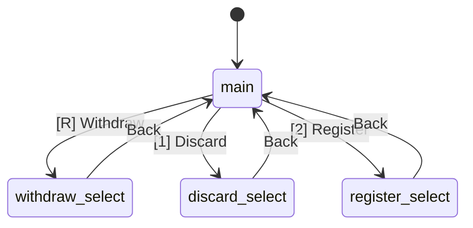

```
Main:         [Back] [Prev] [Next] [---] [Withdraw] [Discard] [Register] [---] [---] [---]
Withdraw:     [Back] [Prev] [Next] [Confirm] [Clear] [1-5=Mark] [---] [---] [---] [---]
Discard:      [Back] [Prev] [Next] [Confirm] [---] [1-5=Pick] [---] [---] [---] [---]
Register:     [Back] [Prev] [Next] [Confirm] [---] [1-5=Pick] [---] [---] [---] [---]
```

**Enter:** Walk to S tile and press Companion/Storage, or select Storage from house main.
**Exit:** Press Back to return to house main.

#### 3d. House Companions (`house_mode == "companions"`)

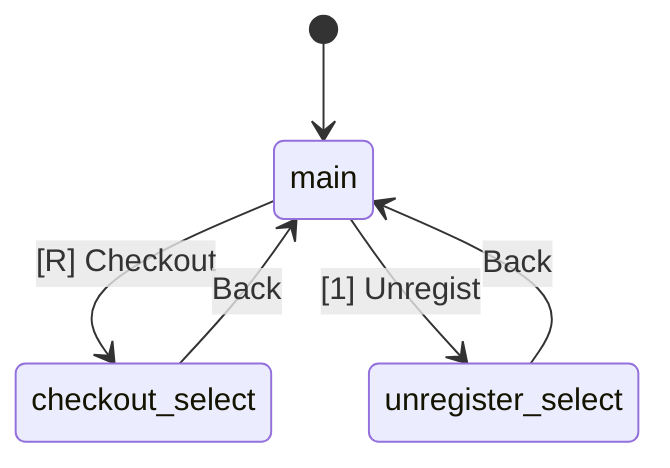

```
Main:         [Back] [---] [---] [---] [Checkout] [Unregist] [---] [---] [---] [---]
Checkout:     [Back] [---] [---] [---] [Clear] [1-5=Mark] [---] [---] [---] [---]
Unregister:   [Back] [---] [---] [Confirm] [---] [1-5=Pick] [---] [---] [---] [---]
```

**Enter:** Walk to C tile and interact.
**Exit:** Press Back to return to house main.

#### 3e. House Upgrades (`house_mode == "upgrades"`)

Three pages of upgrades: Base, Combat, Stats.

```
[Back] [< Prev] [Next >] [PageName] [---] [1-N=Buy] [---] [---] [---] [---]
```

**Enter:** Walk to U tile and interact.
**Exit:** Press Back to return to house main.

#### 3f. House Kennel (`house_mode == "kennel"`)

Bulk companion storage for the Fusion Station (30-500 slots).

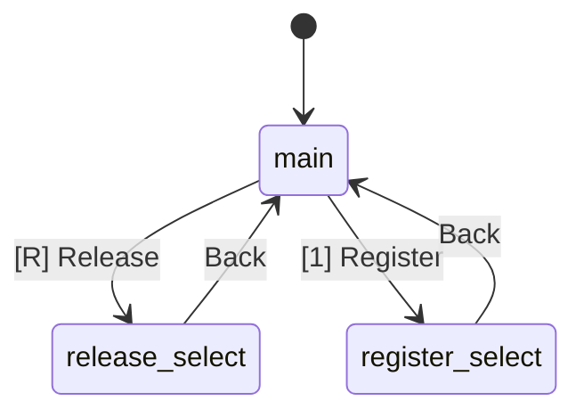

```
Main:         [Back] [< Prev] [Next >] [---] [Release] [Register] [---] [---] [---] [---]
Release:      [Back] [< Prev] [Next >] [Confirm] [---] [1-5 Pick] [---] [---] [---] [---]
Register:     [Back] [< Prev] [Next >] [Confirm] [---] [1-5 Pick] [---] [---] [---] [---]
```

**Enter:** Walk to K tile and interact.
**Exit:** Press Back to return to house main.

#### 3g. House Fusion (`house_mode == "fusion"`)

Combine companions: 3:1 same-type or 8:1 mixed T9.

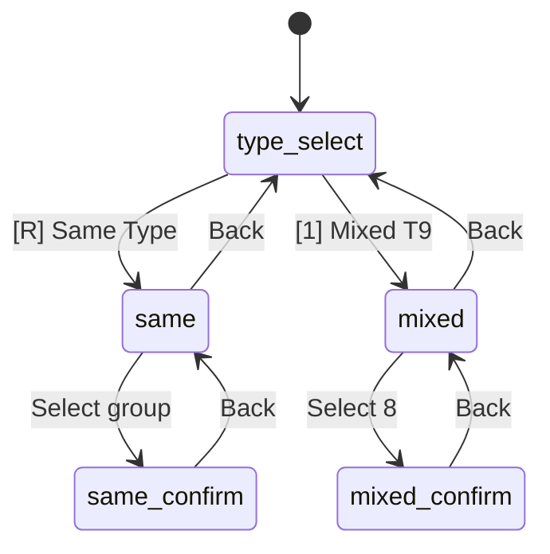

```
Type Select:    [Back] [---] [---] [---] [Same Type] [Mixed T9] [---] [---] [---] [---]
Same (list):    [Back] [---] [---] [---] [1-5 Pick] [---] [---] [---] [---] [---]
Same (confirm): [Back] [---] [---] [Fuse!] [---] [---] [---] [---] [---] [---]
Mixed (list):   [Back] [< Prev] [Next >] [N/8 Sel] [1-5 Mark] [---] [---] [---] [---] [---]
Mixed (confirm):[Back] [---] [Fuse!] [---] [---] [---] [---] [---] [---] [---]
```

**Enter:** Walk to F tile and interact.
**Exit:** Press Back through type select to return to house main.

---

### 4. Summon Consent (`pending_summon_from != ""`)
```
[Decline] [Accept] [---] [---] [---] [---] [---] [---] [---] [---]
```
Shown when another player with Summon ability targets you. Accept teleports you to their location.

---

### 5. Bless Stat Selection (`title_stat_selection_mode`)
```
[Cancel] [STR] [CON] [DEX] [INT] [WIS] [WIT] [---] [---] [---]
```
Choosing which stat to receive +5 from the Bless title ability.

---

### 6. Party Bump Invite (`pending_party_bump != ""`)
```
[Invite] [Cancel] [---] [---] [---] [---] [---] [---] [---] [---]
```

**Enter:** Player bumps into another player (walks onto their tile).
**Exit:** Press Invite (sends party invite) or Cancel.

---

### 7. Party Invite Received (`pending_party_invite != ""`)
```
[Accept] [Decline] [---] [---] [---] [---] [---] [---] [---] [---]
```

**Enter:** Another player sends you a party invite.
**Exit:** Press Accept (joins party) or Decline.

---

### 8. Party Lead/Follow Choice (`party_lead_choice_pending`)
```
[Lead] [Follow] [---] [---] [---] [---] [---] [---] [---] [---]
```

**Enter:** After accepting a party invite when forming a new 2-person party.
**Exit:** Press Lead or Follow to set your role.

---

### 9. Party Disband Confirm (`party_disband_confirm`)
```
[Confirm] [Cancel] [---] [---] [---] [---] [---] [---] [---] [---]
```

**Enter:** Leader presses Disband in the party menu.
**Exit:** Confirm disbands party, Cancel returns to party menu.

---

### 10. Party Leave Confirm (`party_leave_confirm`)
```
[Confirm] [Cancel] [---] [---] [---] [---] [---] [---] [---] [---]
```

**Enter:** Non-leader presses Leave in the party menu.
**Exit:** Confirm leaves party, Cancel returns to party menu.

---

### 11. Party Appoint Mode (`party_appoint_mode`)
```
[Cancel] [Member1] [Member2] [Member3] [---] [---] [---] [---] [---] [---]
```
Non-leader members shown as selectable buttons (up to 3 members, since max party size is 4).

**Enter:** Leader presses Appoint in the party menu (only shown when party > 2 members).
**Exit:** Select a member or Cancel.

---

### 12. Party Menu (`party_menu_mode`)

```
Leader:     [Back] [Disband] [Appoint*] [---] [---] [---] [---] [---] [---] [---]
Non-leader: [Back] [Leave] [---] [---] [---] [---] [---] [---] [---] [---]

* Appoint only shown when party has > 2 members.
```

**Enter:** More menu -> Party button (only shown when `in_party`).
**Exit:** Press Back to return to More menu.

---

### 13. Trade Request (`pending_trade_request`)
```
[Decline] [Accept] [---] [---] [---] [---] [---] [---] [---] [---]
```

---

### 14. Wandering Blacksmith (`pending_blacksmith`)

Random encounter with a blacksmith NPC offering repairs and enhancements.

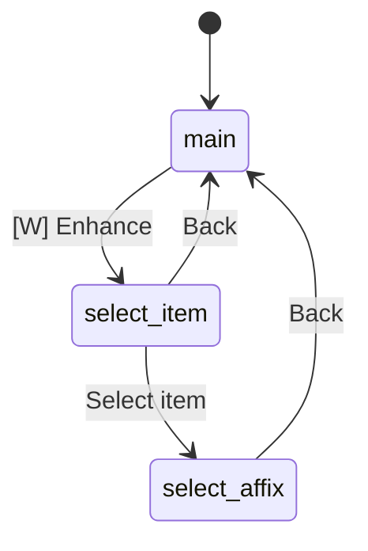

```
Main:         [Decline] [All(Ng)] [Enhance] [---] [---] [1-9=Item] [---] [---] [---] [---]
Select Item:  [Back] [---] [---] [---] [---] [1-9=Item] [---] [---] [---] [---]
Select Affix: [Back] [---] [---] [---] [---] [1-9=Affix] [---] [---] [---] [---]
```

**Enter:** Server sends blacksmith encounter on movement.
**Exit:** Press Decline or complete a transaction.

---

### 15. Wandering Healer (`pending_healer`)

Random encounter with a healer NPC offering healing services.

```
[Decline] [Quick(Ng)] [Full(Ng)] [Cure(Ng)] [---] [---] [---] [---] [---] [---]
```

**Enter:** Server sends healer encounter on movement.
**Exit:** Press Decline or select a healing option.

---

### 16. Guard Post (`at_guard_post`)

Interaction at a guard post station in an NPC post or player post.

```
No Guard:  [Back] [Hire] [---] [---] [---] [---] [---] [---] [---] [---]
Owner:     [Back] [Feed] [Dismiss] [---] [---] [---] [---] [---] [---] [---]
Visitor:   [Back] [---] [---] [---] [---] [---] [---] [---] [---] [---]
```

**Enter:** Player bumps into a guard post tile (G).
**Exit:** Press Back to return to normal movement.

---

### 17. Rescue NPC (`pending_rescue_npc`)

Dungeon rescue quest encounters with different NPC types.

```
Merchant:   [Decline] [---] [---] [---] [---] [1-3=Item] [---] [---] [---] [---]
Breeder:    [Decline] [Accept] [---] [---] [---] [---] [---] [---] [---] [---]
Other:      [Continue] [---] [---] [---] [---] [---] [---] [---] [---] [---]
```

**NPC types:** merchant (buy items), breeder (accept egg), healer/blacksmith/scholar (auto-applied).
**Enter:** Server sends rescue NPC encounter during dungeon exploration.
**Exit:** Press Continue/Decline/Accept or select an item.

---

### 18. Gathering Mode (`gathering_mode`)

Unified 3-choice gathering minigame for Fishing, Mining, Logging, and Foraging.

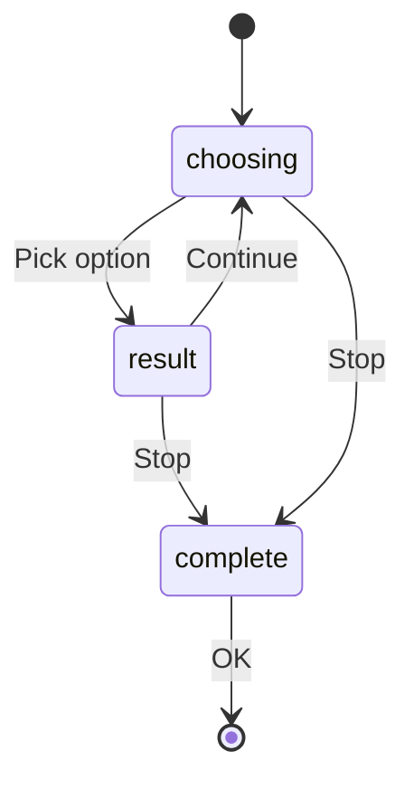

```
Choosing:   [Stop] [---] [---] [---] [Reveal*] [Opt1] [Opt2] [Opt3] [Opt4**] [---]
Result:     [Continue] [Stop] [---] [---] [---] [---] [---] [---] [---] [---]
Complete:   [OK] [---] [---] [---] [---] [---] [---] [---] [---] [---]

* Reveal only shown when tool save is available and reveals remaining > 0.
** Opt4 (risky option) only shown when gathering_risky_available is true.
```

**Mode flag:** `gathering_mode = true`, `gathering_phase` = "choosing" | "result" | "complete"
**Enter:** Press Fish/Mine/Chop/Forage from normal movement action bar (slot 4).
**Exit:** Press Stop during choosing/result, or OK after complete.

---

### 19. Harvest Mode (`harvest_mode`)

Post-combat Soldier job minigame for harvesting materials from defeated monsters.

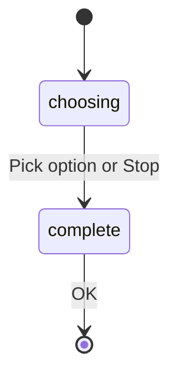

```
Choosing:   [Stop] [---] [---] [---] [---] [Opt1] [Opt2] [Opt3] [---] [---]
Complete:   [OK] [---] [---] [---] [---] [---] [---] [---] [---] [---]
```

**Mode flag:** `harvest_mode = true`, `harvest_phase` = "choosing" | "complete"
**Enter:** Press Harvest button from pending_continue screen (only shown when `harvest_available = true`).
**Exit:** Press Stop or OK.

---

### 20. Dungeon List (`dungeon_list_mode`)

Viewing list of available dungeons at a dungeon entrance.

```
[Back] [---] [---] [---] [---] [---] [---] [---] [---] [---]
```

Number keys 1-9 select a dungeon from the list (handled separately from action bar).

**Enter:** Press Dungeon from normal movement at a dungeon entrance tile (D).
**Exit:** Press Back to return to normal movement.

---

### 21. Dungeon Pending Continue (`dungeon_mode and pending_continue`)

Waiting for player acknowledgement after combat/event while inside a dungeon.

```
[Continue] [Harvest*] [---] [---] [---] [---] [---] [---] [---] [---]

* Harvest only shown when harvest_available is true (Soldier job).
```

**Enter:** After completing a dungeon combat encounter or event.
**Exit:** Press Continue to resume dungeon navigation, or Harvest to enter harvest mode.

---

### 22. Dungeon Navigation (`dungeon_mode and not in_combat`)

Navigating dungeon floors. Movement is via arrow keys/WASD (not action bar buttons).

```
[Items] [Rest/Meditate] [Exit*] [Back**] [---] [---] [---] [---] [---] [---]

* Exit only enabled when standing on entrance tile.
** Back (return to previous floor) only enabled on entrance tile when floor > 1.
```

**Mode flags:** `dungeon_mode = true`, `in_combat = false`, `pending_continue = false`, `flock_pending = false`, `inventory_mode = false`, `wish_selection_mode = false`
**Enter:** Enter a dungeon from dungeon list, or continue after dungeon combat.
**Exit:** Press Exit at dungeon entrance, or get defeated.

---

### 23. Active Trade (`in_trade`)

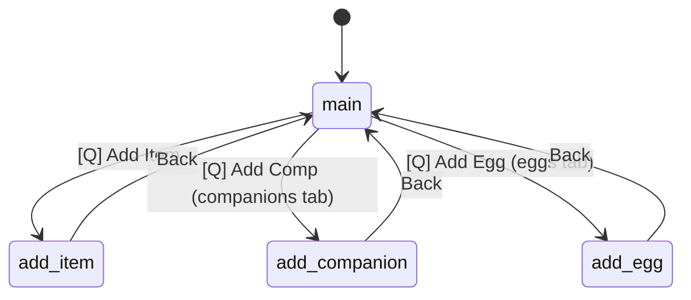

```
Main:           [---] [Add Item/Comp/Egg] [Remove] [Ready/Unready] [Cancel] [Items] [Comps] [Eggs] [---] [---]
Add Item:       [Back] [---] [---] [---] [---] [---] [---] [---] [Prev] [Next]
Add Companion:  [Back] [---] [---] [---] [---] [---] [---] [---] [---] [---]
Add Egg:        [Back] [---] [---] [---] [---] [---] [---] [---] [---] [---]
```

Main trade window has three tabs controlled by `trade_tab`: "items", "companions", "eggs".

---

### 24. Wish Selection (`wish_selection_mode`)
```
[---] [Wish 1] [Wish 2] [Wish 3] [---] [---] [---] [---] [---] [---]
```

---

### 25. Monster Select (`monster_select_mode`)

Used when activating a summon scroll to pick a target monster type.

```
List:       [Cancel] [Prev Pg] [Next Pg] [---] [---] [1-9 Select] [---] [---] [---] [---]
Confirm:    [Back] [Confirm] [---] [---] [---] [---] [---] [---] [---] [---]
```

---

### 26. Target Farm (`target_farm_mode`)

Used when activating a target farm scroll to pick which monster type to farm.

```
[Cancel] [---] [---] [---] [---] [1-5 Select] [---] [---] [---] [---]
```

---

### 27. Home Stone Mode (`home_stone_mode`)

Selecting which item/egg/equipment to send to house storage via a Home Stone.

```
Supplies:       [Send (N)] [Cancel] [Sel All] [< Prev] [Next >] [1-9 Toggle] [---] [---] [---] [---]
Egg/Equipment:  [Cancel] [---] [---] [---] [---] [1-N Select] [---] [---] [---] [---]
```

**Sub-types:** `home_stone_type` = "supplies" (multi-select), "egg" or "equipment" (single-select).
**Enter:** Use a Home Stone item from inventory.
**Exit:** Press Cancel or Send/Select.

---

### 28. Ability Mode (`ability_mode`)
```
Main:           [Back] [Equip] [Unequip] [---] [---] [---] [---] [---] [---] [---]
Choose Ability: [Cancel] [Prev] [Next] [---] [---] [1-N Select] [---] [---] [---] [---]
Press Keybind:  [Cancel] [---] [---] [---] [---] [Press Key] [---] [---] [---] [---]
Select Slot:    [Cancel] [---] [---] [---] [---] [1-6 Slot] [---] [---] [---] [---]
```

**Sub-states:** `pending_ability_action` = "" (main), "choose_ability", "press_keybind", "select_ability", "select_unequip_slot", "select_keybind_slot"

---

### 29. Title Mode (`title_mode`)
```
Main:         [Back] [Ability1] [Ability2] [Ability3] [Ability4] [---] [---] [---] [---] [---]
Target:       [Cancel] [---] [---] [---] [---] [1-9 Select] [---] [---] [---] [---]
```

---

### 30. Combat Item Mode (`combat_item_mode`)
```
[Cancel] [Prev Pg] [Next Pg] [---] [---] [---] [---] [---] [---] [---]
```
Number keys 1-9 select items from the paginated usable items list.

---

### 31. Solo Combat (`in_combat`)
```
Default:   [Attack] [Use Item] [Flee] [Outsmart] [Ability1] [Ability2] [Ability3] [Ability4] [Ability5] [Ability6]
Swapped:   [Outsmart] [Use Item] [Flee] [Attack] [Ability1-6...]  (when swap_attack_outsmart is true)
Ability1st:[Ability1] [Use Item] [Flee] [Outsmart] [Attack] [Ability2-6...]  (when swap_attack_with_ability is true)
```

---

### 32. Party Combat - Our Turn (`party_combat_active`)

Same layout as solo combat but with no Use Item option (items disabled in party combat).

```
Default:   [Attack] [---] [Flee] [Outsmart] [Ability1] [Ability2] [Ability3] [Ability4] [Ability5] [Ability6]
```

---

### 33. Party Combat - Waiting (`party_waiting_for_turn`)
```
[Wait: PlayerName] [---] [---] [---] [---] [---] [---] [---] [---] [---]
```
All buttons disabled. Shows whose turn it is.

---

### 34. Party Combat - Spectating (`party_combat_spectating`)
```
[Spectating] [---] [---] [---] [---] [---] [---] [---] [---] [---]
```
All buttons disabled. Player is dead or fled during party combat.

---

### 35. Flock Pending (`flock_pending`)
```
[Continue] [---] [---] [---] [---] [---] [---] [---] [---] [---]
```
After defeating a flock member, continue to fight the next one.

---

### 36. Pending Continue (`pending_continue`)
```
[Continue] [Harvest*] [---] [---] [---] [---] [---] [---] [---] [---]

* Harvest only shown when harvest_available is true (Soldier job, post-combat).
```

**Special Case: Quest Log Mode (`quest_log_mode`)**

When viewing the quest log from the world map (not at a trading post), `quest_log_mode` is set alongside `pending_continue`. In this mode:
- Action bar shows Continue button only (slot 0, Space key)
- Number keys (1-5) are used to abandon quests, NOT action bar slots 5-9
- Action bar slots 5-9 are blocked to prevent conflicts with quest abandonment
- Slot 0 (Continue/Space) remains active so player can exit the quest log

---

### 37. Dungeon Level Warning (`pending_dungeon_warning`)
```
[Enter Anyway] [Cancel] [---] [---] [---] [---] [---] [---] [---] [---]
```
Shown when player tries to enter a dungeon below the recommended level.

---

### 38. Hotzone Entry Warning (`pending_hotzone_warning`)
```
[Enter] [Back] [---] [---] [---] [---] [---] [---] [---] [---]
```
Shown when player tries to enter a dangerous hotzone area.

---

### 39. Corpse Loot (`pending_corpse_loot`)
```
[Loot All] [Cancel] [---] [---] [---] [---] [---] [---] [---] [---]
```
Shown when player steps on a corpse with lootable items.

**Enter:** Press Loot from normal movement at a corpse tile.
**Exit:** Press Loot All or Cancel.

---

### 40. More Menu (`more_mode`)

Hub menu providing access to Companions, Eggs, Jobs, Leaderboards, Changelog, Bestiary, Pouch, and Party.

```
Main:     [Back] [Companions] [Eggs] [Jobs] [Leaders] [Changes] [Bestiary] [Pouch] [Party*] [---]
Subview:  [Back] [---] [---] [---] [---] [---] [---] [---] [---] [---]

* Party button only shown when in_party is true.
```

**Sub-states:** `pending_more_action` = "" (main), "changelog", "bestiary", "viewing_materials"
**Enter:** Press More (slot 5) from normal movement.
**Exit:** Press Back to return to normal movement.

---

### 41. Companions Mode (`companions_mode`)

View, inspect, release, sort, and manage collected companions.

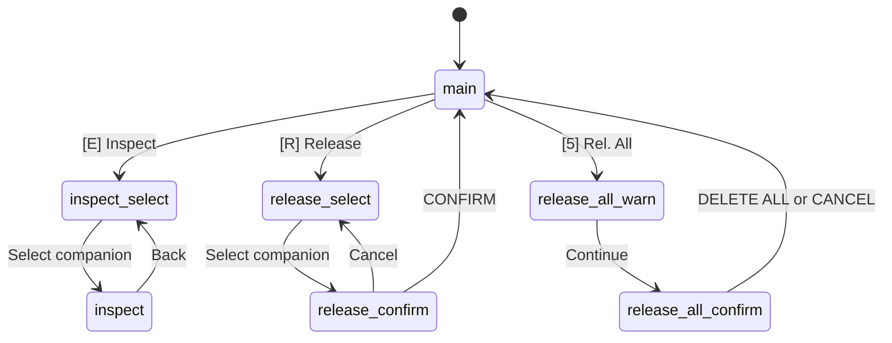

```
Main:           [Back] [< Prev] [Next >] [Inspect] [Release] [1-N Select] [Dismiss] [Sort] [Asc/Desc] [Rel. All]
Inspect Select: [Cancel] [< Prev] [Next >] [---] [---] [1-N Select] [---] [---] [---] [---]
Inspect View:   [Back] [---] [---] [---] [---] [---] [---] [---] [---] [---]
Release Select: [Cancel] [< Prev] [Next >] [---] [---] [1-N Select] [---] [---] [---] [---]
Release Confirm:[Cancel] [CONFIRM] [---] [---] [---] [---] [---] [---] [---] [---]
Rel All Warn:   [Cancel] [Continue] [---] [---] [---] [---] [---] [---] [---] [---]
Rel All Final:  [CANCEL] [DELETE ALL] [---] [---] [---] [---] [---] [---] [---] [---]
```

**Sub-states:** `pending_companion_action` = "", "inspect_select", "inspect", "release_select", "release_confirm", "release_all_warn", "release_all_confirm"
**Enter:** More menu -> Companions.
**Exit:** Press Back to return to More menu.

---

### 42. Job Mode (`job_mode`)

View job levels across two pages (Gathering and Specialty) with optional job commitment.

```
Main:     [Back] [< Prev] [Next >] [---] [---] [Commit X*] [Commit Y*] [...] [...] [...]
Confirm:  [Cancel] [Commit!] [---] [---] [---] [---] [---] [---] [---] [---]

* Commit buttons only shown for jobs at level 5+ that haven't been committed yet.
  Page 0 (Gathering): mining, logging, foraging, soldier, fishing
  Page 1 (Specialty): blacksmith, builder, alchemist, scribe, enchanter
```

**Sub-states:** `pending_job_action` = "", "commit_confirm"; `job_page` = 0 or 1
**Enter:** More menu -> Jobs.
**Exit:** Press Back to return to More menu.

---

### 43. Eggs Mode (`eggs_mode`)

View incubating eggs with ASCII art and toggle freeze status.

```
[Back] [< Prev] [Next >] [---] [---] [Freeze/Unfrz 1] [Freeze/Unfrz 2] [Freeze/Unfrz 3] [---] [---]
```

Shows 3 eggs per page with freeze toggle buttons.
**Enter:** More menu -> Eggs.
**Exit:** Press Back to return to More menu.

---

### 44. Build Mode (`build_mode`)

Building structures in player posts (enclosures).

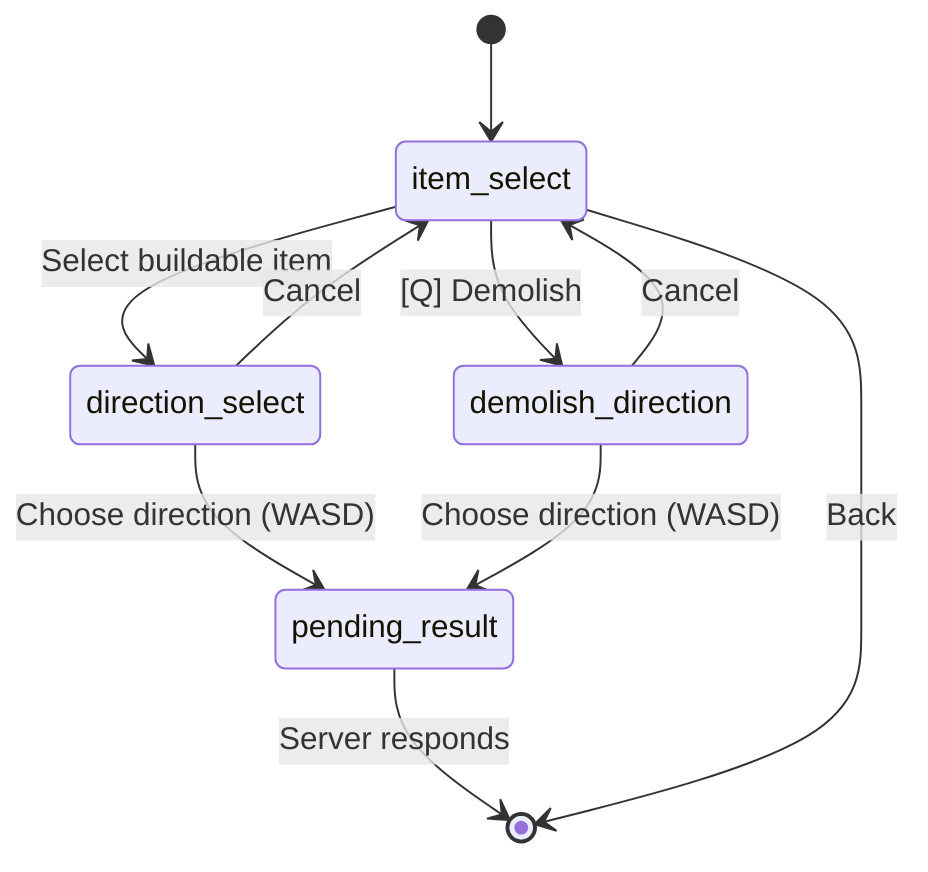

```
Item Select:    [Back] [Demolish] [---] [---] [---] [---] [---] [---] [---] [---]
Direction:      [Cancel] [---] [---] [---] [---] [---] [---] [---] [---] [---]
Pending Result: [---] [---] [---] [---] [---] [---] [---] [---] [---] [---]  (all disabled)
```

Direction selection uses WASD keys (handled via `_input()`), not action bar buttons.

**Mode flags:** `build_mode = true`, `build_direction_mode` (placing), `build_demolish_mode` (removing), `pending_build_result` (waiting for server)
**Enter:** Press Build from normal movement action bar slot 4 (only shown when `in_own_enclosure`).
**Exit:** Press Back from item select, or Cancel from direction select.

---

### 45. Merchant (`at_merchant`)
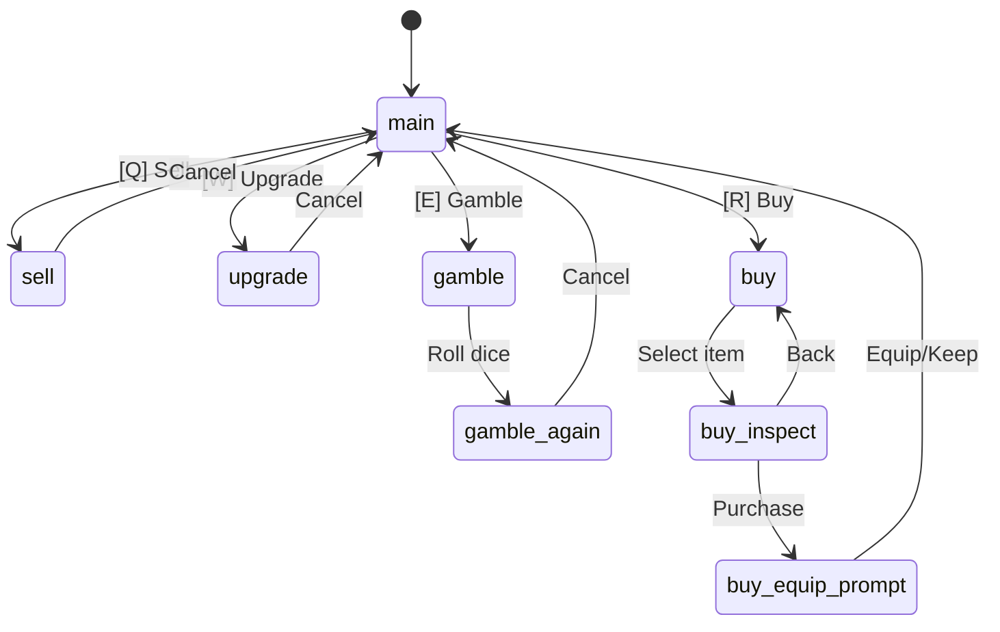

```
Main:       [Leave] [Sell] [Upgrade] [Gamble] [Buy] [---] [---] [---] [---] [---]
Sell:       [Cancel] [Prev] [Next] [---] [Sell Equip] [1-9 Sell] [---] [---] [---] [---]
Upgrade:    [Cancel] [Weapon] [Armor] [Helm] [Shield] [Boots] [Ring] [Amulet] [All+1(Ng)] [---]
Gamble:     [Cancel] [---] [---] [---] [---] [---] [---] [---] [---] [---]
Again:      [Bet Again(N)] [Cancel] [---] [---] [---] [---] [---] [---] [---] [---]
Buy:        [Cancel] [---] [---] [---] [---] [---] [---] [---] [---] [---]
Inspect:    [Buy(Ng)] [Back] [---] [---] [---] [---] [---] [---] [---] [---]
Equip:      [Equip Now] [Keep] [---] [---] [---] [---] [---] [---] [---] [---]
```

---

### 46. Inventory (`inventory_mode`)
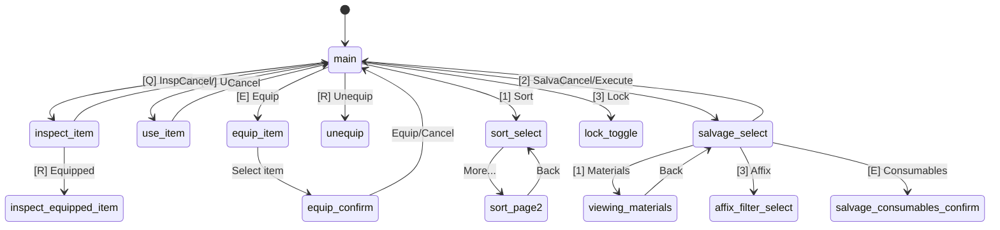

```
Main:           [Back] [Inspect] [Use] [Equip] [Unequip] [Sort] [Salvage] [Lock] [Prev Pg] [Next Pg]
Sort P1:        [Cancel] [Level] [HP] [ATK] [DEF] [WIT] [Mana] [Speed] [Slot] [More...]
Sort P2:        [Back] [Rarity] [Cmp:XXX] [---] [---] [---] [---] [---] [---] [---]
Salvage:        [Cancel] [All(<LvN)] [All Equipment] [Consumables] [Discard] [Materials] [Auto:XXX] [Affix(N)] [---] [---]
Salvage Consum: [Cancel] [Confirm] [---] [---] [---] [---] [---] [---] [---] [---]
Affix Filter:   [Cancel] [Prev] [Next] [Save] [Clear] [1-7 Select] [---] [---] [---] [---]
Materials:      [Back] [---] [---] [---] [---] [---] [---] [---] [---] [---]
Equip Confirm:  [Equip] [Cancel] [---] [---] [---] [---] [---] [---] [---] [---]
Equip Select:   [Cancel] [Prev Pg] [Next Pg] [---] [---] [---] [---] [---] [---] [---]
Use Select:     [Cancel] [Prev Pg] [Next Pg] [---] [---] [---] [---] [---] [---] [---]
Rune Apply:     [Cancel] [---] [---] [---] [---] [1-9 Select] [---] [---] [---] [---]
Item Select:    [Cancel] [Prev Pg] [Next Pg] [---] [Equipped*] [---] [---] [---] [---] [---]
```

**Sub-states:** `pending_inventory_action` = "", "inspect_item", "inspect_equipped_item", "use_item", "equip_item", "equip_confirm", "unequip_item", "sort_select", "salvage_select", "salvage_consumables_confirm", "affix_filter_select", "viewing_materials", "rune_apply", "lock_toggle"

---

### 47. Crafting Challenge Mode (`crafting_challenge_mode`)

Minigame that appears during crafting for quality bonuses. Three answer options per round.

```
[---] [---] [---] [---] [---] [Option1] [Option2] [Option3] [---] [---]
```

**Enter:** Server sends crafting challenge after player confirms a craft.
**Exit:** Complete all rounds (auto-exits to craft result).

---

### 48. Crafting Mode (`crafting_mode`)

Crafting sub-menu for all 5 crafting skills. Works at both NPC trading posts and player-built stations.

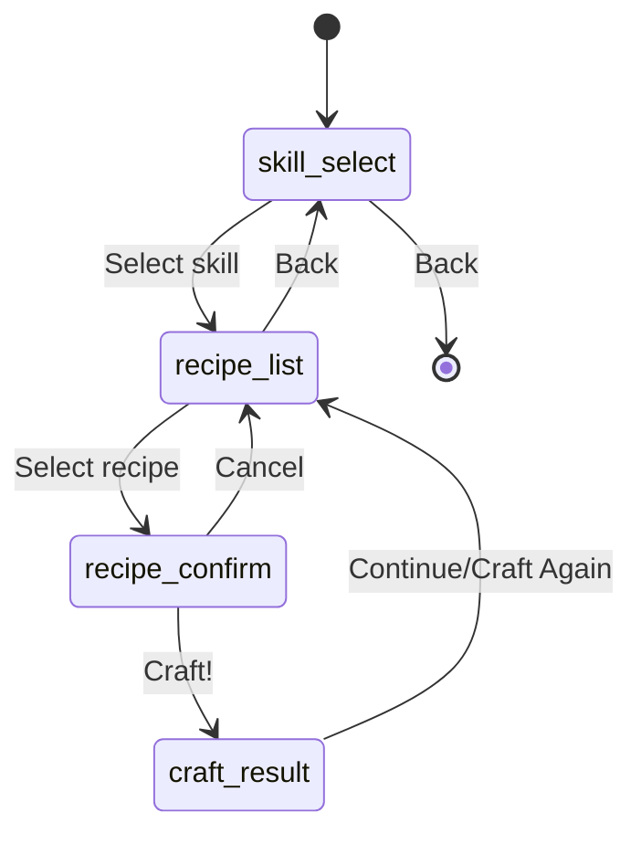

```
Skill Select:   [Back] [Smith] [Alchemy] [Enchant] [Scribing] [Build] [---] [---] [---] [---]
Recipe List:    [Back] [< Prev] [Next >] [---] [---] [1-5 Select] [---] [---] [---] [---]
Recipe Confirm: [Cancel] [Craft!] [---] [---] [---] [---] [---] [---] [---] [---]
Craft Result:   [Craft Again*] [Back] [---] [---] [---] [---] [---] [---] [---] [---]
  or:           [Continue] [---] [---] [---] [---] [---] [---] [---] [---] [---]

* Craft Again only shown when can_craft_another is true.
```

**Mode flags:** `crafting_mode = true`, `crafting_skill` = "" | "blacksmithing" | "alchemy" | "enchanting" | "scribing" | "construction"
**Enter:** Press Craft at an NPC trading post or player-built crafting station.
**Exit:** Press Back from skill select.

---

### 49. Storage Mode (`storage_mode`)

Storage chest at a player post (enclosure). Deposit/withdraw items.

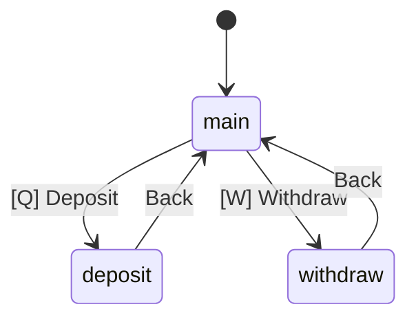

```
Main:       [Back] [Deposit] [Withdraw*] [---] [---] [---] [---] [---] [---] [---]
Deposit:    [Back] [---] [---] [---] [---] [1-9 Select] [---] [---] [---] [---]
Withdraw:   [Back] [---] [---] [---] [---] [1-9 Select] [---] [---] [---] [---]

* Withdraw only enabled when storage_items.size() > 0.
```

**Mode flags:** `storage_mode = true`, `pending_storage_action` = "" | "deposit" | "withdraw"
**Enter:** Press Storage (slot 9) from normal movement inside own enclosure.
**Exit:** Press Back from main storage view.

---

### 50. Market Mode (`market_mode`)

Player-to-player marketplace at NPC trading posts. Browse, list, and manage market listings.

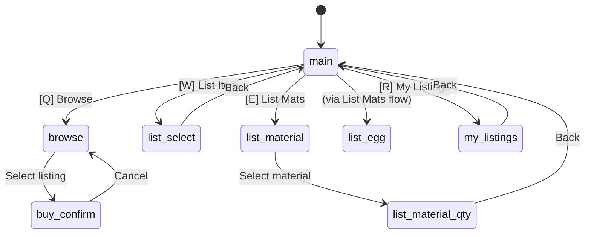

```
Main:           [Back] [Browse] [List Item] [List Mats] [My Listings] [---] [---] [---] [---] [---]
Browse:         [Back] [Prev Page] [Next Page] [Filter] [Sort: XXX] [1-9 Buy] [---] [---] [---] [---]
List Select:    [Back] [Prev Page] [Next Page] [---] [---] [1-9 Select] [---] [---] [---] [---]
List Material:  [Back] [Prev Page] [Next Page] [---] [---] [1-9 Select] [---] [---] [---] [---]
List Mat Qty:   [Back] [List All] [---] [---] [---] [---] [---] [---] [---] [---]
List Egg:       [Back] [Prev Page] [Next Page] [---] [---] [1-9 Select] [---] [---] [---] [---]
Buy Confirm:    [Confirm] [Cancel] [---] [---] [---] [---] [---] [---] [---] [---]
My Listings:    [Back] [Prev Page] [Next Page] [Pull All] [---] [1-9 Cancel] [---] [---] [---] [---]
```

**Mode flags:** `market_mode = true`, `pending_market_action` = "" | "browse" | "list_select" | "list_material" | "list_material_qty" | "list_egg" | "buy_confirm" | "my_listings"
**Enter:** Available at NPC trading posts (via market interaction).
**Exit:** Press Back from main market menu.

---

### 51. Quest View Mode (`quest_view_mode`)

Quest selection sub-menu triggered by bumping the quest board at a trading post.

```
[Back] [---] [---] [---] [---] [---] [---] [---] [---] [---]
```

Number keys 1-9 select quests from the displayed list.

**Enter:** Bump quest board tile at a trading post.
**Exit:** Press Back.

---

### 52. Normal Movement (`has_character`)

The default state when the player has an active character and is on the world map.

```
Default:      [Rest/Med] [Inventory] [Status] [Title/Help] [Context*] [More] [Settings] [Cloak**] [Teleport***] [Char Select]
Own Encl:     [Rest/Med] [Inventory] [Status] [Title/Help] [Build] [More] [Craft****] [Inn*****] [Storage] [Char Select]
Visit Post:   [Rest/Med] [Inventory] [Status] [Title/Help] [Context*] [More] [Craft****] [Inn*****] [Cloak] [Char Select]
```

**Slot 3 (Title/Help):** Shows "Title" if player has a title, "High Seat" if at (0,0), otherwise "Help".

**Slot 4 context-sensitive (*) based on location:**
- At water (~): Fish
- At ore deposit: Mine TN
- At dense forest: Chop TN
- At foraging spot: Forage TN
- At dungeon entrance (D): Dungeon
- At Infernal Forge with crown: Forge
- At Fire Mountain: Fire Mt
- At bounty target: Engage!
- At corpse: Loot
- In own enclosure: Build
- Otherwise: Quests

**Slot 7 (**) Cloak:** Only shown at level 20+.
**Slot 8 (***) Teleport:** Unlocks at Mage 30, Trickster 45, Warrior 60.
**Slot 6 (****) Craft:** Only in enclosures with crafting stations.
**Slot 7 (*****) Inn:** Only in enclosures with an inn building.

---

### 53. No Character
```
[Help] [---] [---] [---] [---] [---] [---] [---] [---] [---]
```

---

## Key Bindings

| Slot | Default Key | Action Map |
|------|-------------|------------|
| 0 | Space | action_0 (Primary) |
| 1 | Q | action_1 |
| 2 | W | action_2 |
| 3 | E | action_3 |
| 4 | R | action_4 |
| 5 | 1 | action_5 |
| 6 | 2 | action_6 |
| 7 | 3 | action_7 |
| 8 | 4 | action_8 |
| 9 | 5 | action_9 |

**Note:** Slots 5-9 share keys with item selection (1-5). Action bar takes priority when the slot has an enabled action.

## Common Bug: Missing `update_action_bar()` Call

After changing ANY of these variables, you MUST call `update_action_bar()`:

- `settings_mode`, `settings_submenu`, `rebinding_action`
- `game_state` (DEAD, HOUSE_SCREEN)
- `house_mode`, `pending_house_action`, `house_interactable_at`, `house_fusion_type`, `pending_home_stone_choice`
- `pending_summon_from`
- `title_stat_selection_mode`
- `pending_party_bump`, `pending_party_invite`, `party_lead_choice_pending`
- `party_disband_confirm`, `party_leave_confirm`, `party_appoint_mode`, `party_menu_mode`
- `pending_trade_request`, `in_trade`, `trade_pending_add`, `trade_pending_add_companion`, `trade_pending_add_egg`, `trade_tab`
- `pending_blacksmith`, `blacksmith_upgrade_mode`
- `pending_healer`
- `at_guard_post`, `guard_post_data`
- `pending_rescue_npc`, `rescue_npc_type`
- `gathering_mode`, `gathering_phase`
- `harvest_mode`, `harvest_phase`, `harvest_available`
- `dungeon_list_mode`
- `dungeon_mode`, `pending_continue` (dungeon pending continue)
- `wish_selection_mode`
- `monster_select_mode`, `monster_select_confirm_mode`
- `target_farm_mode`
- `home_stone_mode`, `home_stone_type`
- `ability_mode`, `pending_ability_action`
- `title_mode`, `title_target_mode`
- `combat_item_mode`
- `in_combat`
- `party_combat_active`, `party_waiting_for_turn`, `party_combat_spectating`
- `flock_pending`, `pending_continue`, `quest_log_mode`
- `pending_dungeon_warning`, `pending_hotzone_warning`, `pending_corpse_loot`
- `more_mode`, `pending_more_action`
- `companions_mode`, `pending_companion_action`
- `job_mode`, `pending_job_action`, `job_page`
- `eggs_mode`
- `build_mode`, `build_direction_mode`, `build_demolish_mode`, `pending_build_result`
- `at_merchant`, `pending_merchant_action`
- `inventory_mode`, `pending_inventory_action`, `sort_menu_page`
- `crafting_challenge_mode`
- `crafting_mode`, `crafting_skill`, `crafting_selected_recipe`, `awaiting_craft_result`
- `storage_mode`, `pending_storage_action`
- `market_mode`, `pending_market_action`
- `quest_view_mode`
