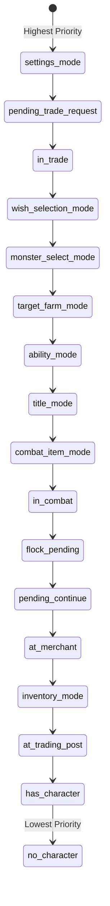
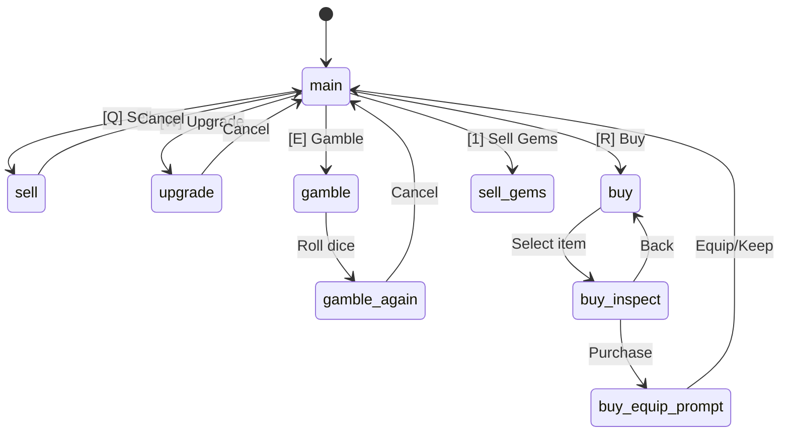
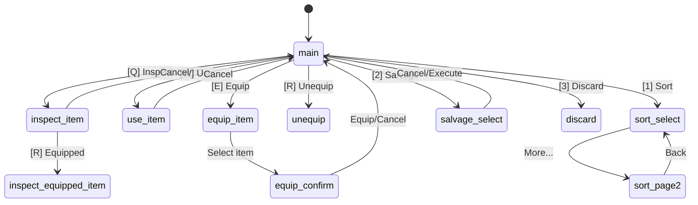

# Action Bar State Machine

The action bar is the primary UI interaction system. It displays 10 buttons that change based on game state.

## State Priority Chain

States are checked in this exact order. **First match wins.**



## State Details

### 1. Settings Mode (`settings_mode`)
```
Submenus: main → action_keys | movement_keys | item_keys
          rebinding_action (waiting for key press)

Main:     [Back] [Actions] [Movement] [Items] [Reset] [---] [---] [---] [---] [---]
Rebind:   [Press Key] [---] [---] [---] [---] [---] [---] [---] [---] [Cancel]
```

### 2. Trade Request (`pending_trade_request`)
```
[---] [Accept] [Decline] [---] [---] [---] [---] [---] [---] [---]
```

### 3. Active Trade (`in_trade`)
```
Main:       [---] [Add Item] [Remove] [Ready/Unready] [Cancel] [---] [---] [---] [---] [---]
Adding:     [Back] [---] [---] [---] [---] [---] [---] [---] [Prev] [Next]
```

### 4. Wish Selection (`wish_selection_mode`)
```
[---] [Wish 1] [Wish 2] [Wish 3] [---] [---] [---] [---] [---] [---]
```

### 5. Monster Select (`monster_select_mode`)
```
List:       [Cancel] [Prev Pg] [Next Pg] [---] [---] [1-9 Select] [---] [---] [---] [---]
Confirm:    [Confirm] [Back] [---] [---] [---] [---] [---] [---] [---] [---]
```

### 6. Target Farm (`target_farm_mode`)
```
[Cancel] [---] [---] [---] [---] [1-5 Select] [---] [---] [---] [---]
```

### 7. Ability Mode (`ability_mode`)
```
Main:           [Back] [Equip] [Unequip] [---] [---] [---] [---] [---] [---] [---]
Choose Ability: [Cancel] [---] [---] [---] [---] [1-N Select] [---] [---] [---] [---]
Press Keybind:  [Cancel] [---] [---] [---] [---] [Press Key] [---] [---] [---] [---]
Select Slot:    [Cancel] [---] [---] [---] [---] [1-4 Slot] [---] [---] [---] [---]
```

### 8. Title Mode (`title_mode`)
```
Main:   [Back] [Ability1] [Ability2] [Ability3] [Ability4] [---] [---] [---] [---] [---]
Target: [Cancel] [---] [---] [---] [---] [1-9 Select] [---] [---] [---] [---]
```

### 9. Combat Item Mode (`combat_item_mode`)
```
[Cancel] [Prev Pg] [Next Pg] [---] [---] [---] [---] [---] [---] [---]
```

### 10. Combat (`in_combat`)
```
[Attack] [Use Item] [Flee] [Outsmart] [Ability1] [Ability2] [Ability3] [Ability4] [Ability5] [Ability6]
```

### 11. Flock Pending (`flock_pending`)
```
[Continue] [---] [---] [---] [---] [---] [---] [---] [---] [---]
```

### 12. Pending Continue (`pending_continue`)
```
[Continue] [---] [---] [---] [---] [---] [---] [---] [---] [---]
```

**Special Case: Quest Log Mode (`quest_log_mode`)**

When viewing the quest log from the world map (not at a trading post), `quest_log_mode` is set alongside `pending_continue`. In this mode:
- Action bar shows Continue button only (slot 0, Space key)
- Number keys (1-5) are used to abandon quests, NOT action bar slots 5-9
- Action bar slots 5-9 are blocked to prevent conflicts with quest abandonment
- Slot 0 (Continue/Space) remains active so player can exit the quest log

### 13. Merchant (`at_merchant`)


```
Main:       [Leave] [Sell] [Upgrade] [Gamble] [Buy] [SellGems] [---] [---] [---] [---]
Sell:       [Cancel] [Prev] [Next] [---] [Sell All] [1-9 Sell] [---] [---] [---] [---]
Upgrade:    [Cancel] [Weapon] [Armor] [Helm] [Shield] [Boots] [Ring] [Amulet] [All+1] [---]
Gamble:     [Cancel] [---] [---] [---] [---] [---] [---] [---] [---] [---]
Again:      [Bet Again] [Cancel] [---] [---] [---] [---] [---] [---] [---] [---]
Buy:        [Cancel] [---] [---] [---] [---] [---] [---] [---] [---] [---]
Inspect:    [Buy] [Back] [---] [---] [---] [---] [---] [---] [---] [---]
Equip:      [Equip Now] [Keep] [---] [---] [---] [---] [---] [---] [---] [---]
```

### 14. Inventory (`inventory_mode`)


```
Main:       [Back] [Inspect] [Use] [Equip] [Unequip] [Sort] [Salvage] [Discard] [Prev Pg] [Next Pg]
Sort P1:    [Cancel] [Level] [HP] [ATK] [DEF] [WIT] [Mana] [Speed] [Slot] [More...]
Sort P2:    [Back] [Rarity] [Cmp:XXX] [---] [---] [---] [---] [---] [---] [---]
Salvage:    [Cancel] [All(<LvN)] [All Items] [---] [---] [---] [---] [---] [---] [---]
Equip Cnf:  [Equip] [Cancel] [---] [---] [---] [---] [---] [---] [---] [---]
Item Sel:   [Cancel] [Prev Pg] [Next Pg] [---] [Equipped] [---] [---] [---] [---] [---]
```

### 15. Trading Post (`at_trading_post`)
```
Main:   [Status] [Shop] [Quests] [Heal(Ng)] [---] [---] [---] [---] [---] [---]
Quests: [Back] [---] [---] [---] [---] [---] [---] [---] [---] [---]
```

### 16. Normal Movement (`has_character`)
```
[Status] [Inventory] [Rest/Meditate] [Title/Help] [Quests/Forge] [Leaders] [Settings] [Cloak*] [Teleport*] [Logout]

* Cloak appears at level 20+
* Teleport appears at level 30+ (Mage), 45+ (Trickster), 60+ (Warrior)
```

### 17. No Character
```
[Help] [---] [---] [---] [---] [---] [---] [---] [---] [---]
```

## Key Bindings

| Slot | Default Key | Action Map |
|------|-------------|------------|
| 0 | Space | action_0 (Primary) |
| 1 | Q | action_1 |
| 2 | W | action_2 |
| 3 | E | action_3 |
| 4 | R | action_4 |
| 5 | 1 | action_5 |
| 6 | 2 | action_6 |
| 7 | 3 | action_7 |
| 8 | 4 | action_8 |
| 9 | 5 | action_9 |

**Note:** Slots 5-9 share keys with item selection (1-5). Action bar takes priority when the slot has an enabled action.

## Common Bug: Missing `update_action_bar()` Call

After changing ANY of these variables, you MUST call `update_action_bar()`:

- `settings_mode`, `settings_submenu`, `rebinding_action`
- `pending_trade_request`, `in_trade`, `trade_pending_add`
- `wish_selection_mode`
- `monster_select_mode`, `monster_select_confirm_mode`
- `target_farm_mode`
- `ability_mode`, `pending_ability_action`
- `title_mode`, `title_target_mode`
- `combat_item_mode`
- `in_combat`
- `flock_pending`, `pending_continue`, `quest_log_mode`
- `at_merchant`, `pending_merchant_action`
- `inventory_mode`, `pending_inventory_action`, `sort_menu_page`
- `at_trading_post`, `quest_view_mode`
