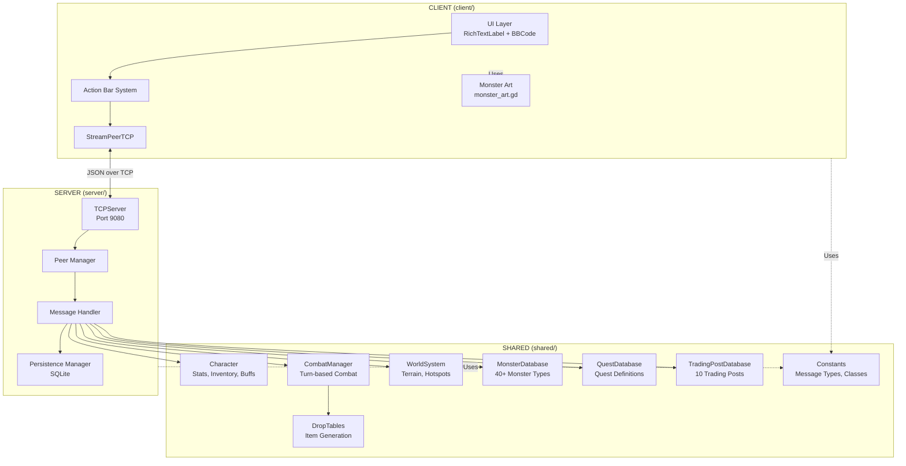
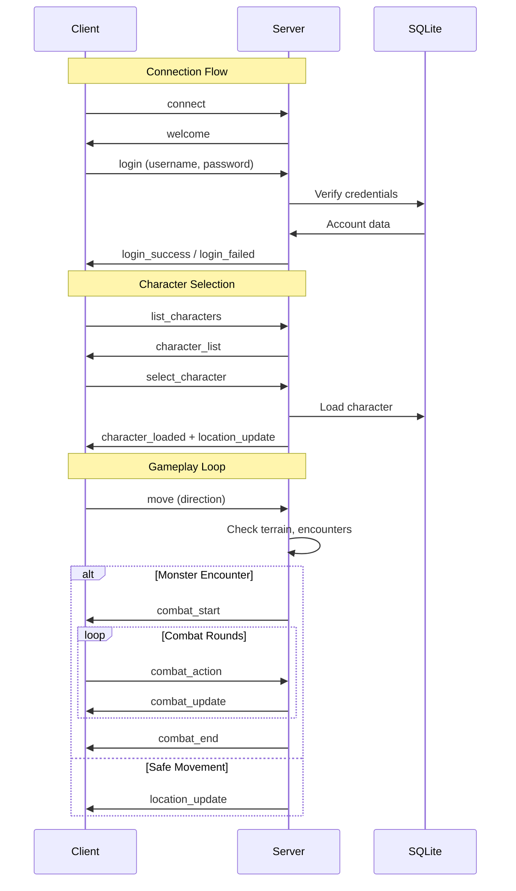
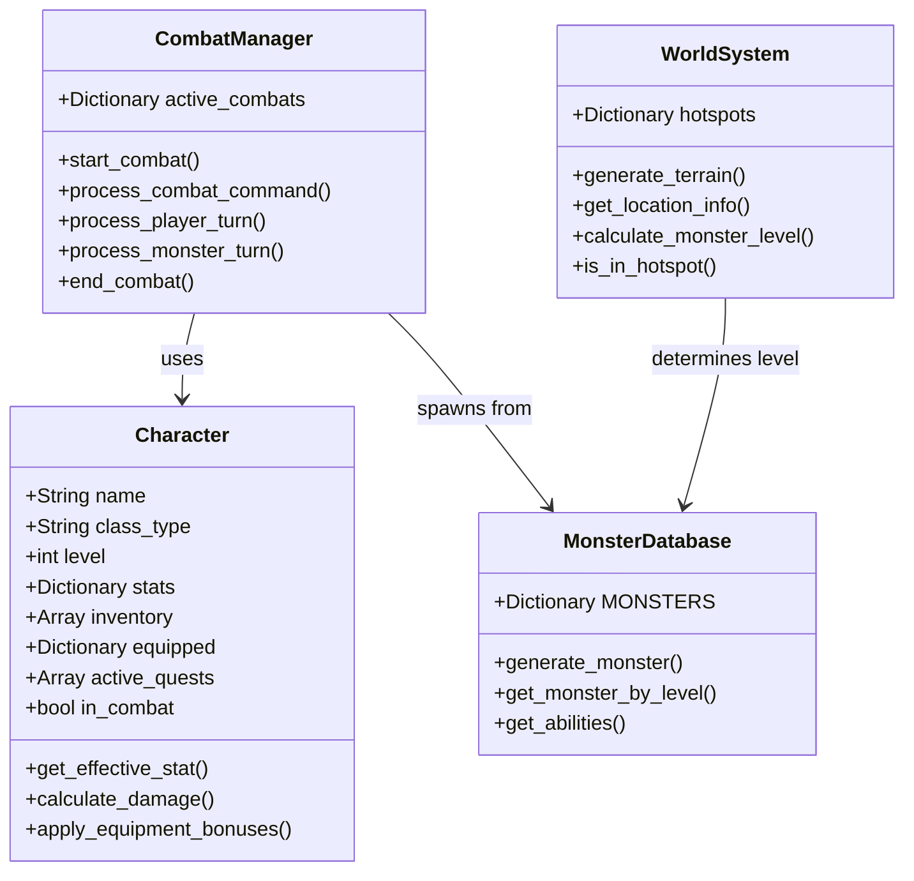

# Phantom Badlands - Architecture Overview

## System Architecture



## Key Files Reference

| File | Lines | Purpose |
|------|-------|---------|
| `client/client.gd` | ~24000 | Main client, UI, networking, action bar, market |
| `client/monster_art.gd` | ~1200 | ASCII art rendering |
| `server/server.gd` | ~15000 | Server logic, message routing, market, crafting |
| `server/persistence_manager.gd` | ~1500 | SQLite persistence, houses, market listings |
| `shared/character.gd` | ~1200 | Player data, stats, inventory, companions |
| `shared/combat_manager.gd` | ~5000 | Turn-based combat engine, party combat |
| `shared/world_system.gd` | ~1200 | Terrain, chunks, gathering nodes |
| `shared/monster_database.gd` | ~1400 | Monster definitions (9 tiers) |
| `shared/quest_database.gd` | ~900 | Quest definitions |
| `shared/drop_tables.gd` | ~4000 | Item generation, crafting materials, valor calc |
| `shared/crafting_database.gd` | ~2000 | Crafting recipes, materials, stations |
| `shared/chunk_manager.gd` | ~500 | 32x32 chunk system, delta updates |

## Data Flow



## Class Hierarchy



## Trading Posts Map

```
                    Frozen Reach (0, -400)
                          |
                          |
                    Frostgate (0, -100)
                          |
    Inferno (-350, 0) --- Westhold (-150, 0) --- Crossroads (0, 0) --- Eastwatch (150, 0) --- Void's Edge (350, 0)
                                                      |
                                                 Haven (0, 10) [SPAWN]
                                                      |
                                                Southport (0, -150)

                    Shadowmere (300, 300) [High-level hub]
```
