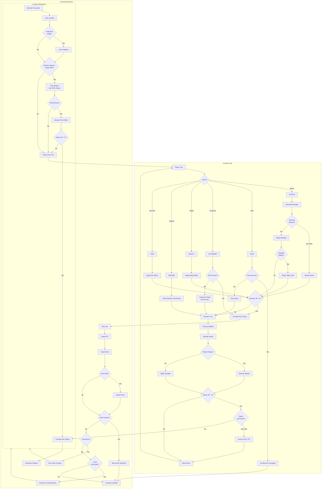
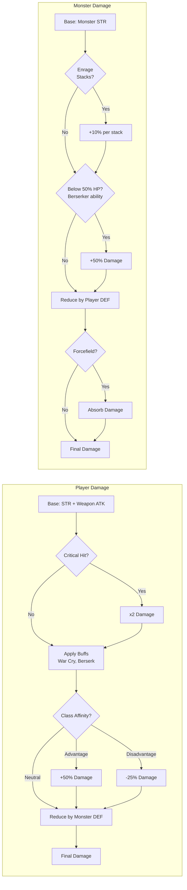
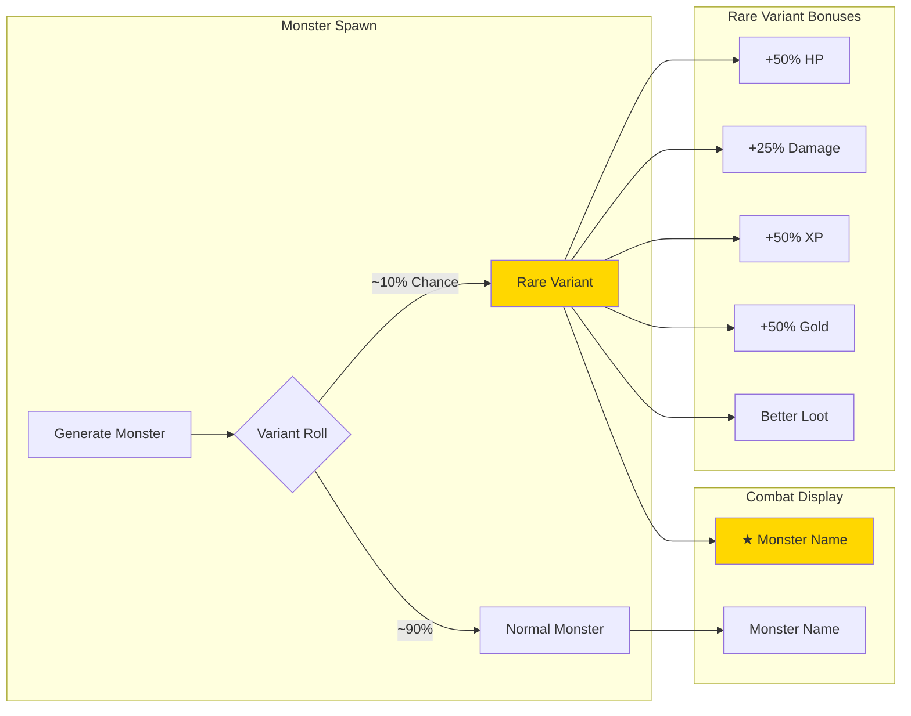
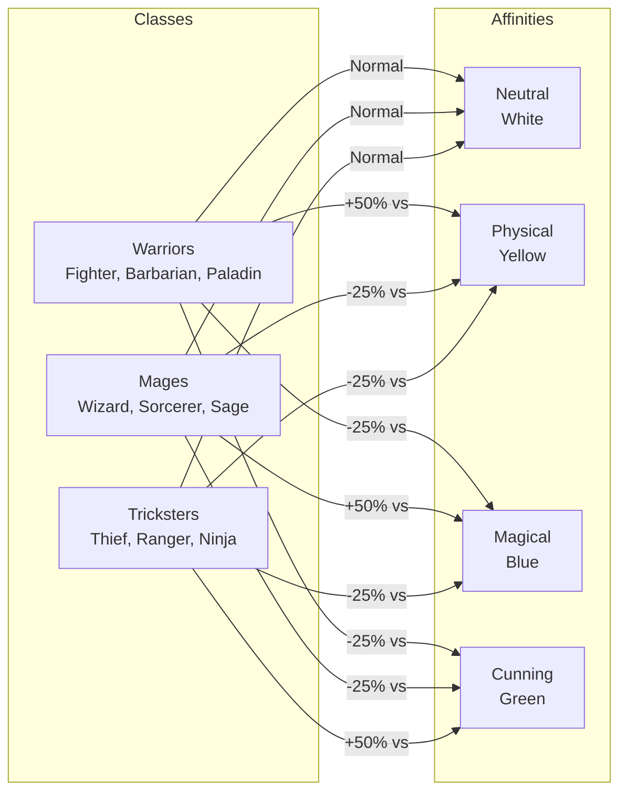

# Combat System Flow

## Combat Lifecycle



## Damage Calculation



## Rare Monster Variants

Some monsters spawn as rare variants with enhanced stats and rewards.



**Visual Indicator:** Rare variants show a **★** before their name:
```
★ Goblin Warrior (Lvl 12): [████████░░] 85/170
```

| Bonus | Amount |
|-------|--------|
| HP | +50% |
| Damage | +25% |
| XP Reward | +50% |
| Gold Reward | +50% |
| Loot Quality | Improved |

**Flock Encounters:** Rare variants can appear in flock encounters - each monster rolls independently.

---

## Monster Ability Effects

| Ability | When | Effect |
|---------|------|--------|
| `glass_cannon` | Spawn | 3x damage, 50% HP |
| `multi_strike` | Attack | 2-3 attacks per turn |
| `poison` | Hit | 40% chance poison player |
| `mana_drain` | Hit | Steal player mana |
| `regeneration` | Turn Start | Heal 10% HP |
| `damage_reflect` | Player Attack | Reflect 25% damage |
| `ethereal` | Player Attack | 50% dodge chance |
| `armored` | Always | +50% defense |
| `berserker` | Below 50% HP | +50% damage |
| `enrage` | Each Round | +10% damage (stacking) |
| `ambusher` | First Attack | Guaranteed crit (2x) |
| `summoner` | 20% per turn | Call reinforcement |
| `wish_granter` | Death | Grant powerful buff |
| `death_curse` | Death | Deal 25% max HP damage |
| `coward` | Below 20% HP | Flee (no loot) |
| `life_steal` | Hit | Heal 50% of damage |
| `thorns` | Player Attack | Reflect 25% melee |
| `charm` | Hit | Player attacks self |
| `gold_steal` | Hit | Steal 5-15% gold |
| `buff_destroy` | Hit | Remove random buff |

## Class Affinity System



## Outsmart Formula

```
Success Chance = 30% + (Player_WITS - Monster_INT) * 0.5%

Minimum: 5%
Maximum: 75%

Rewards on Success:
- Full XP (no penalty)
- Full Gold (no penalty)
- 50% chance to skip negative ability effects
```

## Flee Formula

```
Base Chance = 40%
+ DEX Bonus: +(DEX - 10) * 0.5%
+ Speed Bonus: +Equipment_Speed * 0.3%
- Level Penalty: -(Monster_Level - Player_Level) * 2% (if higher)
+ Trickster Bonus: +10% (Thief, Ranger, Ninja)

Minimum: 10%
Maximum: 90%

Slow Aura: -20% flee chance
```
