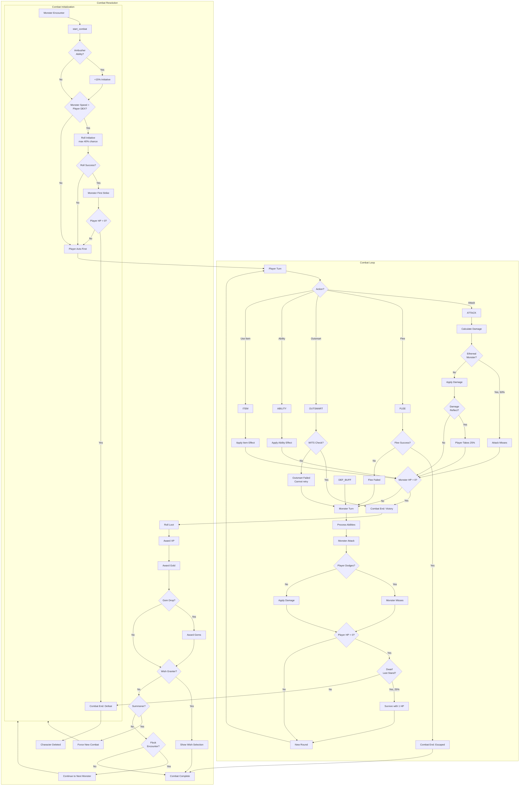

# Combat System Flow

## Combat Lifecycle



## Damage Calculation


## Rare Monster Variants

Some monsters spawn as rare variants with enhanced stats and rewards.


**Visual Indicator:** Rare variants show a **★** before their name:
```
★ Goblin Warrior (Lvl 12): [████████░░] 85/170
```

| Bonus | Amount |
|-------|--------|
| HP | +50% |
| Damage | +25% |
| XP Reward | +50% |
| Gold Reward | +50% |
| Loot Quality | Improved |

**Flock Encounters:** Rare variants can appear in flock encounters - each monster rolls independently.

---

## Monster Ability Effects

| Ability | When | Effect |
|---------|------|--------|
| `glass_cannon` | Spawn | 3x damage, 50% HP |
| `multi_strike` | Attack | 2-3 attacks per turn |
| `poison` | Hit | 40% chance poison player |
| `mana_drain` | Hit | Steal player mana |
| `regeneration` | Turn Start | Heal 10% HP |
| `damage_reflect` | Player Attack | Reflect 25% damage |
| `ethereal` | Player Attack | 50% dodge chance |
| `armored` | Always | +50% defense |
| `berserker` | Below 50% HP | +50% damage |
| `enrage` | Each Round | +10% damage (stacking) |
| `ambusher` | First Attack | Guaranteed crit (2x) |
| `summoner` | 20% per turn | Call reinforcement |
| `wish_granter` | Death | Grant powerful buff |
| `gem_bearer` | Death | Bonus gems (separate from normal drops): 2-5 base + level bonus (L25+1, L50+2, L100+3, L250+4, L500+6, L1000+8, L2000+10, L5000+15) |
| `death_curse` | Death | Deal 25% max HP damage |
| `coward` | Below 20% HP | Flee (no loot) |
| `life_steal` | Hit | Heal 50% of damage |
| `thorns` | Player Attack | Reflect 25% melee |
| `charm` | Hit | Player attacks self |
| `gold_steal` | Hit | Steal 5-15% gold |
| `buff_destroy` | Hit | Remove random buff |

## Class Affinity System


## Outsmart Formula

```
Base Chance: 5%

WITS Bonus (if WITS > 10):
  + 15 × log₂(WITS / 10)
  Examples: WITS 20 = +15%, WITS 40 = +30%, WITS 80 = +45%

Class Bonus:
  + 15% for Tricksters (Thief, Ranger, Ninja)

Monster Intelligence:
  + 3% per INT below 10 (dumb monsters easier)
  - 2% per INT above 10 (smart monsters harder)
  - 2% per point monster INT exceeds your WITS

Level Difference:
  - 2% per level (1-10 levels above you)
  - 1% per level (11-50 levels above you)
  + 1% per level below you (max +15%)

Cap: 85% for Tricksters, 70% for others
  - Reduced by monster INT / 2
  - Minimum cap: 30%

Minimum: 2%

Rewards on Success:
- Full XP and Gold
- Instant victory

Failure Penalty:
- Monster gets free attack
- Cannot retry Outsmart this combat
```

## Flee Formula

```
Base Chance: 40%

+ DEX: +1% per point
+ Equipment Speed: +1% per point (from boots)
+ Speed Buff: +1% per point (from potions/abilities)
+ Flee Bonus: +1% per point (from evasion gear)
- Level Penalty: -3% per level monster is above you

Class Passives:
+ Ninja Shadow Step: +40% flee chance
+ Ninja: No damage on failed flee

Companion Bonus: +flee_bonus% if applicable

Monster Debuffs:
- Slow Aura: -25% flee chance

Minimum: 5%
Maximum: 95%
```
