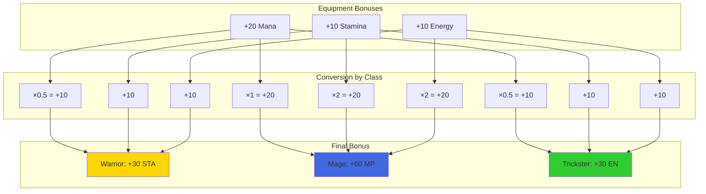
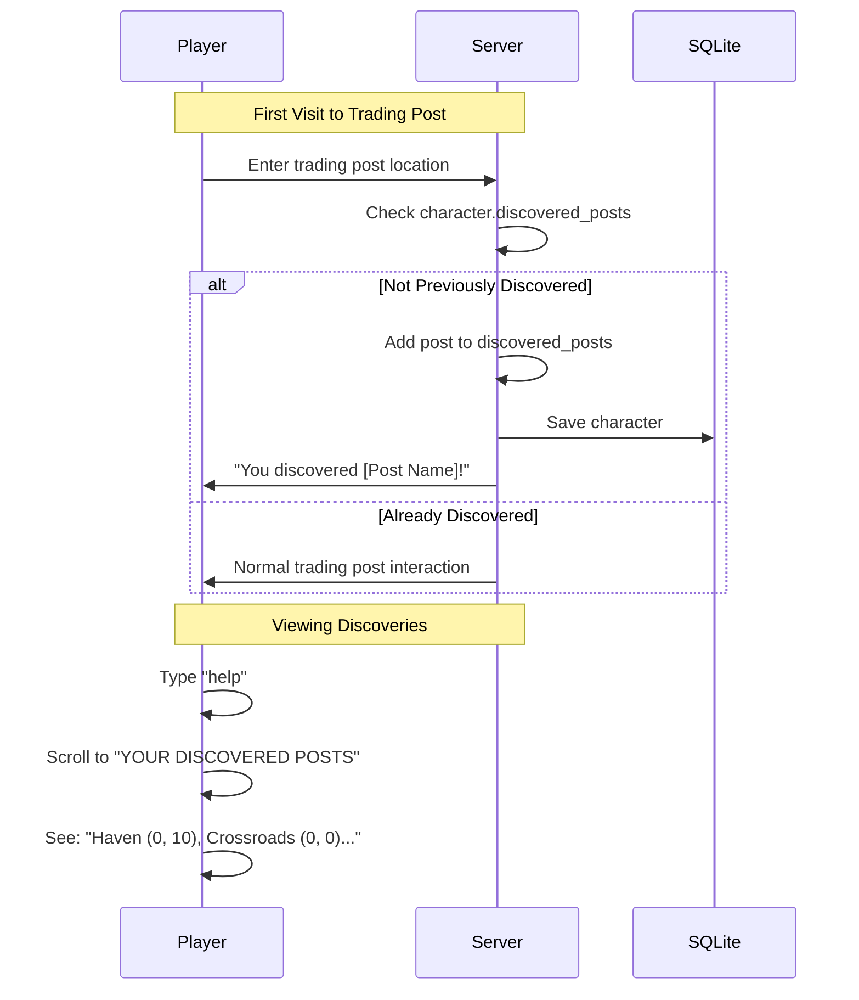
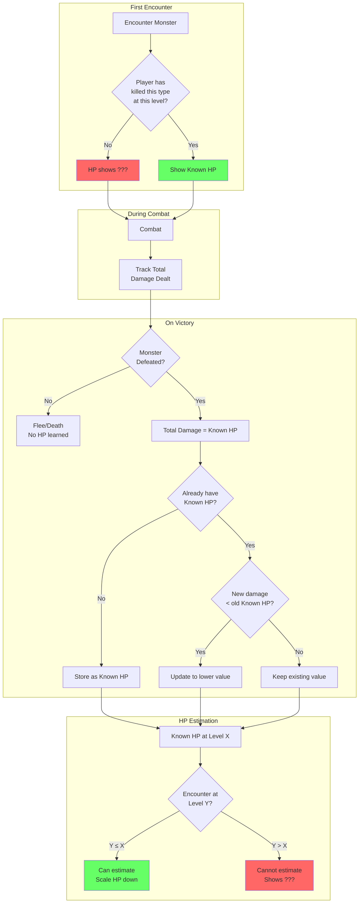
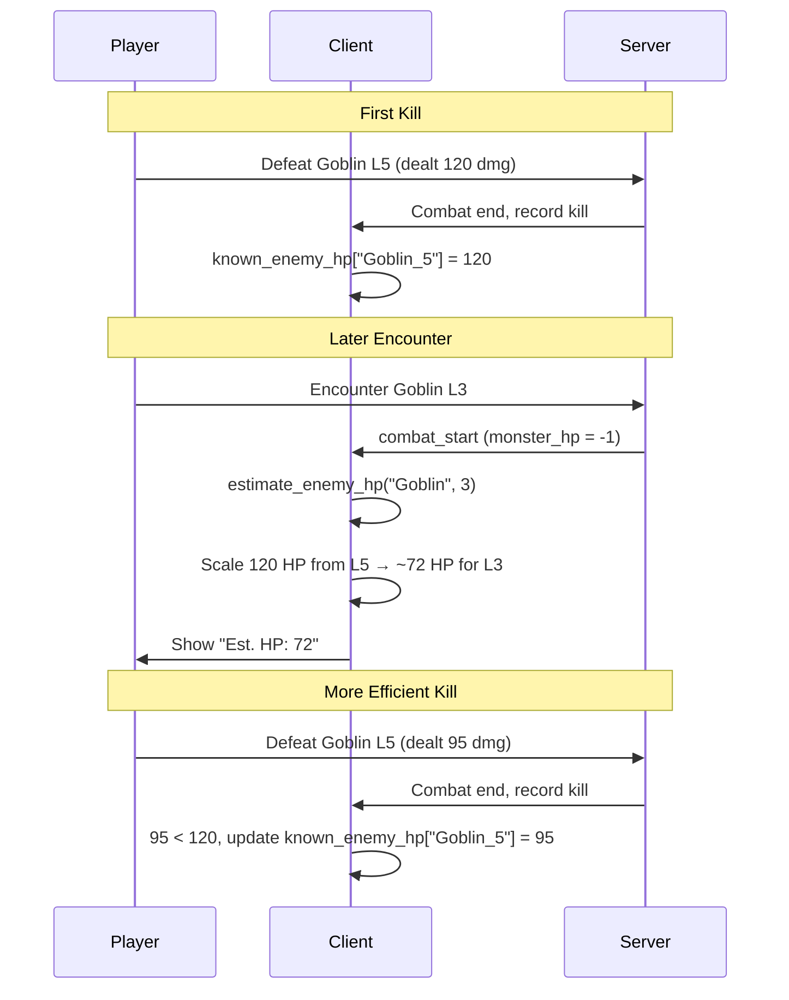
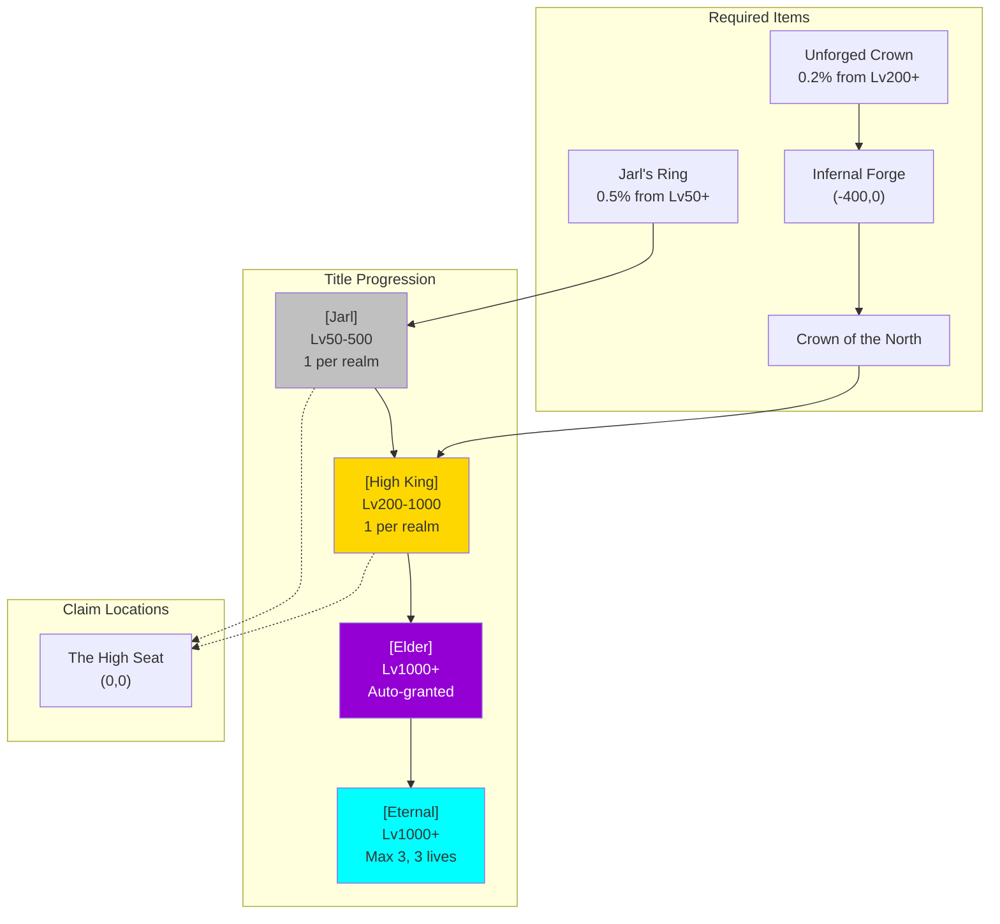
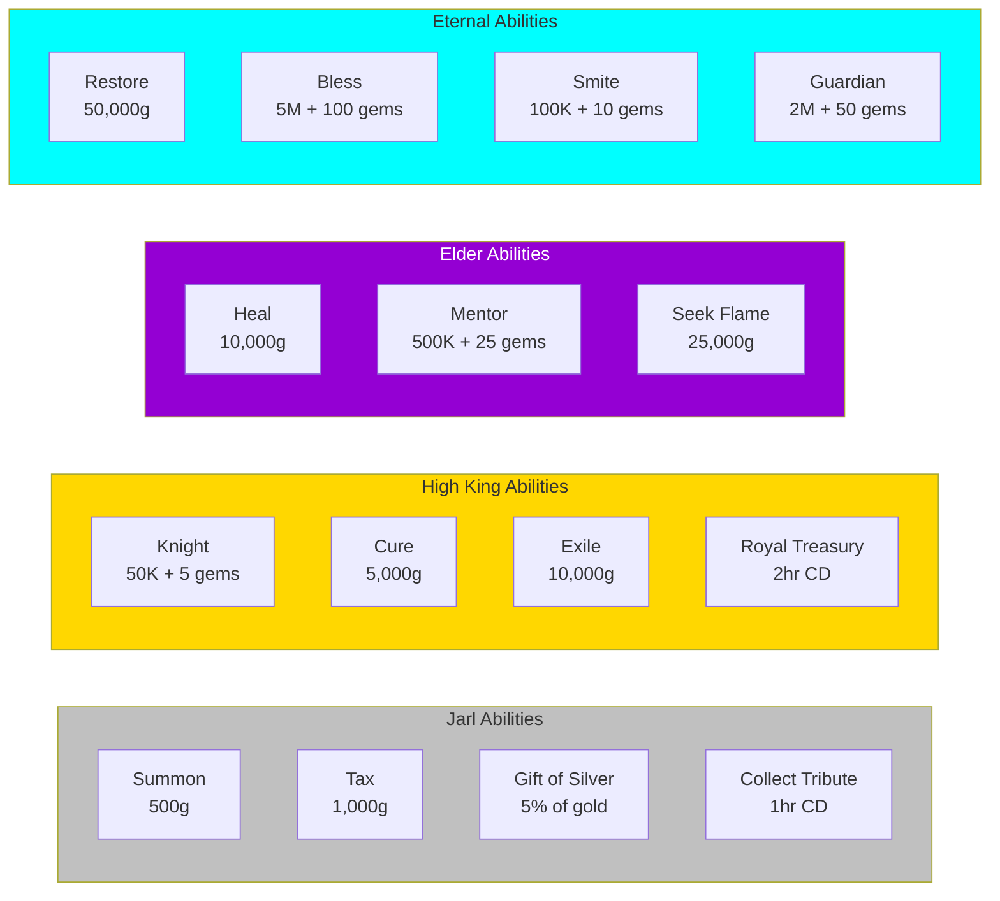
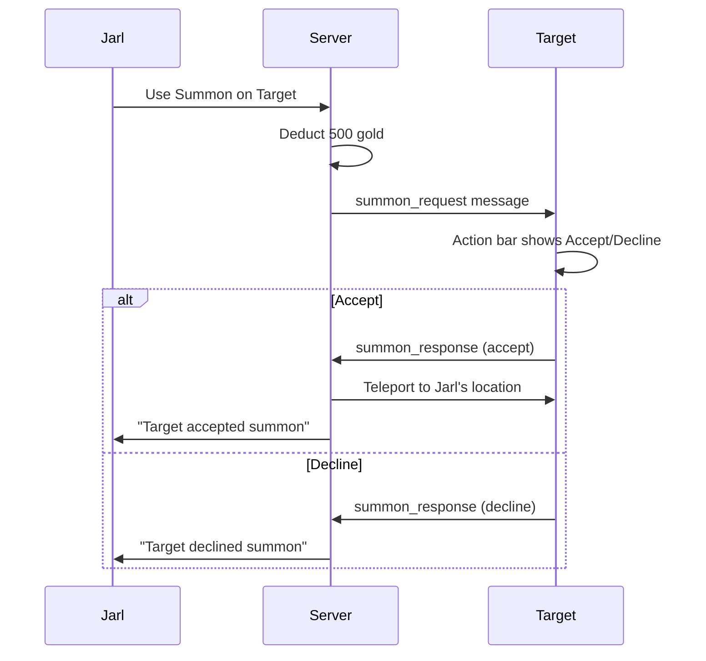
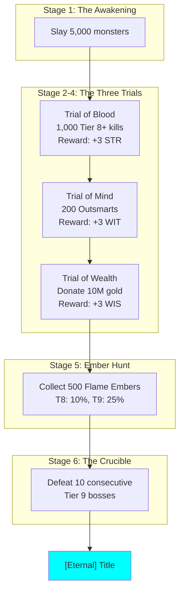

# Game Systems Reference

Detailed documentation for game features and mechanics.

## Account Limits

- **Max characters per account:** 6
- **Character deletion:** Permanent on death (permadeath)

---

## Interactive Tutorial (v0.9.131)

New accounts receive a guided 7-step tutorial on their first character creation.

### Tutorial Steps

| Step | Topic | Description |
|------|-------|-------------|
| 1 | Welcome | Introduction to the game world |
| 2 | Movement | How to move using the action bar (N/S/E/W) |
| 3 | Action Bar | Overview of the 10-slot contextual action bar |
| 4 | Open Inventory | Prompts the player to open their inventory |
| 5 | Close Inventory | Prompts the player to close inventory and return to exploration |
| 6 | Combat Basics | How turn-based combat works (attack, abilities, flee) |
| 7 | Exploration Tips | Gathering, quests, dungeons, and next steps |

### Behavior

- The tutorial overlays action bar slots 0-1 with **Next** and **Skip** buttons
- Players can advance one step at a time or skip the entire tutorial
- The tutorial **pauses automatically** during combat and resumes afterward
- Tutorial state is tracked per account; it only runs once on the first character

---

## Universal Resource Bonuses

Equipment resource stats (mana, stamina, energy) convert to your class's primary resource.



### Conversion Rules

| Your Class Path | Primary Resource | Conversion |
|-----------------|------------------|------------|
| Warrior (Fighter, Barbarian, Paladin) | Stamina | Mana×0.5 + Stamina + Energy |
| Mage (Wizard, Sorcerer, Sage) | Mana | Mana + (Stamina+Energy)×2 |
| Trickster (Thief, Ranger, Ninja) | Energy | Mana×0.5 + Stamina + Energy |

### Why Scaling?

Mana affixes on equipment roll ~2× larger values than stamina/energy affixes. The scaling ensures balanced conversion:
- **Mana → Stamina/Energy:** 0.5× (halved because mana values are larger)
- **Stamina/Energy → Mana:** 2× (doubled to match mana's larger scale)

### Display

- Item tooltips show the converted value with your class's resource label (STA/EN/MP)
- Item comparison brackets show class-appropriate resource differences
- Equipment bonuses in stats screen show final converted values

### Implementation

See `shared/character.gd` `get_equipment_bonuses()` for conversion logic.

---

## Rare Monster Variants

Some monsters spawn as rare variants with enhanced stats.

### Variant Bonuses
- +50% HP
- +25% damage
- +50% XP reward
- +50% gold reward
- Better loot quality

### Visual Indicator

Rare variants display a **★** symbol before their name in the combat HP bar:
```
★ Goblin Warrior (Lvl 12): [████████░░] 85/170
```

### Flock Encounters

Rare variants can appear in flock encounters (multi-monster battles). Each monster in a flock has an independent chance to be a rare variant.

---

## Starter Area Safety (v0.9.131)

Players below level 10 within Manhattan distance 20 of the origin (0,0) have their encounter rate halved. This gives new characters a safer zone to learn the game without being overwhelmed by frequent combat.

**Conditions (both must be met):**
- Player level < 10
- Manhattan distance from (0,0) <= 20 (i.e., `abs(x) + abs(y) <= 20`)

Once either condition is no longer true (player levels past 9 or moves beyond distance 20), the normal encounter rate applies.

---

## Trading Post Discovery

Players can track which trading posts they've visited.



### How It Works

1. When you enter a trading post for the first time, it's recorded to your character
2. Discovered posts appear in your Help page under "YOUR DISCOVERED POSTS"
3. Shows post name and coordinates for easy navigation

### Persistence

Discovered posts are saved with your character data and persist across sessions.

### Viewing Discoveries

Type `help` and search for "discovered" or scroll to the Trading Posts section.

---

## Monster HP Knowledge System

Players discover monster HP through combat experience, not by seeing actual values.



### Key Concepts

| Term | Description |
|------|-------------|
| **Known HP** | Total damage dealt when defeating a monster (may exceed actual HP due to overkill) |
| **Estimated HP** | Scaled from Known HP at higher levels |
| **Discovery** | Players gradually learn true HP by killing more efficiently |

### Data Flow



### Implementation Files

| File | Component |
|------|-----------|
| `shared/character.gd` | `knows_monster()` - Server-side kill tracking |
| `client/client.gd` | `known_enemy_hp` - Client damage tracking |
| `client/client.gd` | `estimate_enemy_hp()` - Level scaling |
| `shared/combat_manager.gd` | Sends `monster_hp = -1` for unknown |

---

## Gem Currency System

Gems are premium currency dropped by high-level monsters.

**Drop Conditions:**
- Monster level must exceed player level by 5+
- Drop chance scales with level difference (2% at 5+, up to 50% at 100+)
- Quantity: `max(1, lethality/1000 + level/100)`

**Drop Chance Table:**
| Level Diff | Chance |
|------------|--------|
| 5+ | 2% |
| 10+ | 5% |
| 20+ | 12% |
| 50+ | 25% |
| 100+ | 50% |

**Uses:**
- Sell to merchants (1000g each)
- Pay for equipment upgrades

---

## Class-Specific Gear

Special monsters drop class-path equipment with unique bonuses.

### Mage Gear (Arcane Hoarder monsters)
| Item | Stats | Class Bonus |
|------|-------|-------------|
| Arcane Ring | INT | Mana Regen/round |
| Mystic Amulet | Max Mana | Meditate bonus |

### Trickster Gear (Cunning Prey monsters)
| Item | Stats | Class Bonus |
|------|-------|-------------|
| Shadow Ring | WITS | Energy Regen/round |
| Evasion Amulet | Speed | Flee chance bonus |
| Swift Boots | Speed, WITS | Energy Regen/round |

### Warrior Gear (Warrior Hoarder monsters)
| Item | Stats | Class Bonus |
|------|-------|-------------|
| Warlord Blade | ATK, STR | Stamina Regen/round |
| Bulwark Shield | DEF, HP, CON | Stamina Regen/round |

**Drop Mechanics:**
- 35% chance from monsters with corresponding ability
- Items level-boosted +15% based on monster level

---

## Cloak System (Universal Ability)

Stealth ability unlocked at level 20 for all classes.

**Mechanics:**
- Costs 8% of max primary resource per movement
- Prevents monster encounters while moving
- Drops when resource runs out
- Hunting breaks cloak
- Merchants can still be encountered
- Toggle via action bar [4] in movement mode

**Display:** Purple `[Cloaked]` status indicator

---

## Ability Loadout System

Customize which abilities are equipped to 4 combat slots.

**Access:** Settings menu [7] "Manage Abilities" or `/abilities` command

**Features:**
- 4 slots for combat abilities (Q, W, E, R default)
- Custom keybinds per slot
- Shows unlocked abilities for class path
- Universal abilities available to all classes

**Backward Compatibility:** Empty loadout uses default class ability slots.

---

## Player Trading System

Trade items between players.

**Command:** `/trade <playername>`

**Requirements:**
- Same location
- Not in combat
- Not in existing trade

**Flow:**
1. Send trade request
2. Partner accepts/declines
3. Both add/remove items
4. Both mark "Ready"
5. Trade executes

**Cancellation Triggers:** Movement, combat, disconnect, explicit cancel

---

## Themed Equipment Display

Equipment names transform based on viewer's class.

**Example:** "Steel Weapon" appears as:
- Fighter: "Steel Sword"
- Barbarian: "Steel Axe"
- Wizard: "Steel Staff"
- Ranger: "Steel Bow"

See `Character.get_themed_item_name()` for full mappings.

---

## High-Tier Drop System (Tier 6+)

### Powerful Consumables
| Item | Effect |
|------|--------|
| Time Stop Scroll | Skip monster's next turn |
| Monster Bane Potions | +50% damage vs type (3 battles) |
| Resurrect Scroll | One-time death prevention |

### Mystery/Gambling Items
| Item | Effect |
|------|--------|
| Mysterious Box | Random item (same tier or +1) |
| Cursed Coin | 50% double gold, 50% lose half |

### Stat Tomes (Tier 6+)
Permanent +1 to a stat. One per stat type.
- Tome of Strength, Intelligence, Dexterity, etc.

### Skill Enhancers (Tier 7+)
Permanent ability upgrades:
- Reduced resource cost (-10%)
- Increased damage (+15%)

### Proc Equipment (Tier 6+)
Equipment with special effects:
| Proc | Effect |
|------|--------|
| Vampire | Lifesteal 10% |
| Thunder | 20% chain lightning |
| Reflection | Reflect 20% damage |
| Slayer | +25% vs type |

### Trophy Drops (Tier 8-9)
5% drop from specific bosses:
- Dragon Scale, Lich Phylactery, Titan Heart
- Entropy Shard (2% from Entropy)

### Soul Gems / Companions (Tier 7+)
Summon combat companions (one active at a time):
| Companion | Bonus |
|-----------|-------|
| Wolf Spirit | +10% attack |
| Phoenix Ember | 2% HP regen/round |
| Shadow Wisp | +15% flee chance |

---

## Quest Scaling System

Quests scale to player level with progressive difficulty.

**Mechanics:**
- Quest requirements scale to ~70-80% of player level
- Difficulty increases with quests completed at same post (+5% per quest, max +50%)
- Eventually pushes players toward next trading post

**Progression Quests:**
- Auto-generated exploration quests to next trading post
- Appear when player level >= recommended level for next post

---

## Shrieker Summoning

The Shrieker summons random high-tier monsters instead of copies.

| Tier | Chance | Examples |
|------|--------|----------|
| 4 | 40% | Giant, Dragon Wyrmling, Demon |
| 5 | 25% | Ancient Dragon, Demon Lord, Lich |
| 6 | 15% | Elemental, Iron Golem, Sphinx |
| 7 | 10% | Void Walker, World Serpent |
| 8 | 7% | Cosmic Horror, Time Weaver |
| 9 | 3% | Avatar of Chaos, Entropy |

---

## Leaderboards

Two leaderboard views accessible via the "Leaders" button on the action bar or `/leaders` command.

### Hall of Fallen Heroes
Ranks deceased characters by experience gained before death.

**Display:** Character name, level, class, XP, cause of death
**Ranking:** Top 100 by experience (descending)

### Deadliest Monsters
Tracks which monsters have killed the most players (permadeath only).

**Display:** Monster name, total player kills
**Grouping:** All monster levels combined (e.g., all Ogres count together)
**Ranking:** Top 20 by kill count (descending)

**Toggle:** Use the "Show Deadliest Monsters" / "Show Fallen Heroes" button to switch views.

---

## Title System

Endgame progression through unique titles with powerful abilities.

### Title Hierarchy



### Title Requirements

| Title | Level | Item | Location | Unique |
|-------|-------|------|----------|--------|
| Jarl | 50-500 | Jarl's Ring | (0,0) | 1 per realm |
| High King | 200-1000 | Crown of the North | (0,0) | 1 per realm |
| Elder | 1000+ | None (auto) | N/A | Unlimited |
| Eternal | 1000+ | Pilgrimage | N/A | Max 3 |

### Title Abilities & Costs



### Special Statuses

| Status | Granted By | Bonuses | Duration |
|--------|------------|---------|----------|
| Knight | High King | +15% dmg, +10% gold | Until replaced |
| Mentee | Elder | +30% XP, +20% gold | Until replaced |
| Guardian Save | Eternal | One death prevented | Until used |

### Summon Consent System



---

## Eternal Pilgrimage

The path to becoming Eternal requires completing 6 stages.

### Pilgrimage Flow



### Pilgrimage Commands

| Command | Description |
|---------|-------------|
| Seek Flame | Check pilgrimage progress (Elder ability, 25K gold) |
| `/donate <amount>` | Donate gold at Shrine of Wealth (Trial of Wealth) |
| `/crucible` | Start the Crucible gauntlet (final stage) |

### Ember Drop Rates

| Source | Chance | Amount |
|--------|--------|--------|
| Tier 8 monster | 10% | 1 |
| Tier 9 monster | 25% | 1-3 |
| Rare variant | 100% | 2 |
| Boss monster | 100% | 5 |

### The Crucible

The final pilgrimage stage is a gauntlet of 10 consecutive Tier 9 boss fights.

**Rules:**
- Bosses are spawned one at a time
- Victory spawns the next boss immediately
- Death resets Crucible progress (but keeps previous trial completions)
- Cannot flee during Crucible
- Victory completes the pilgrimage and grants Eternal title

---

## Tax Collector System

Roaming tax collectors take gold from players.

**Trigger:** 5% chance per movement when carrying 100+ gold. Tax collector encounter prevents other encounters (merchant/blacksmith/healer) on the same step.

**Tax Rate:** 8% of current gold (minimum 10g)

**Immunity:** Jarls and High Kings are immune to tax collection

**Variants:**
| Type | Effect |
|------|--------|
| Quick | Standard 8% tax |
| Bumbling | Only 5% tax |
| Veteran | 10% tax |
| Negotiator | Standard tax + 5% gold find for 3 battles |

---

## Abuse Prevention

Title holders can lose their title through abuse of power.

### Abuse Points

| Action | Points |
|--------|--------|
| Same target within 30 min | +3 |
| Targeting 20+ levels lower | +2 |
| Targeting player in combat | +3 |
| Spam (3+ abilities in 10 min) | +2 |

### Thresholds

| Title | Threshold |
|-------|-----------|
| Jarl | 8 points |
| High King | 15 points |

**Decay:** 1 point per hour

**Consequence:** Losing title removes all abilities and the title prefix

---

## Dungeon System

Procedural dungeons that spawn at random world locations. Dungeons span all 9 tiers with BSP-generated floor layouts, step pressure mechanics, hidden traps, gathering nodes, and escape-only exit policy.

### Dungeon Tiers

Dungeons cover all tiers (T1-T9). Each tier spans a level range, with 8 sub-tiers subdividing it further:

| Tier | Level Range | Notes |
|------|-------------|-------|
| T1 | 1-12 | Beginner dungeons |
| T2 | 6-22 | |
| T3 | 16-40 | |
| T4 | 31-60 | |
| T5 | 51-120 | |
| T6 | 101-500 | |
| T7 | 501-2000 | Dungeon-exclusive crystals start here |
| T8 | 2001-5000 | |
| T9 | 5001-10000 | Endgame dungeons |

### Dungeon Flow

1. **Find Entrance** - Dungeons spawn at random world coordinates (higher tier = further from origin)
2. **Entry Warning** - Every dungeon entry shows a warning: no free exit, escape scroll required, collapse risk
3. **Enter** - Confirm entry (level warning also shown if under-leveled)
4. **Explore** - Navigate BSP-generated grid floors using Q/W/E/R for N/S/W/E movement
5. **Encounters** - Step on `?` tiles to fight monsters (same type as the dungeon boss)
6. **Gathering** - Step on `&` tiles to gather ore, herbs, or crystals (costs 5 steps)
7. **Treasures** - Step on `$` tiles for loot (gold, materials, rare eggs, 20% escape scroll chance)
8. **Traps** - Hidden traps on empty tiles; triggered by stepping on them
9. **Rest** - Consume food materials to recover HP/mana (action bar button)
10. **Boss** - Final floor has a boss; defeat to complete the dungeon
11. **Exit** - Use an Escape Scroll (only safe exit) or complete the dungeon

### Dungeon Tiles

| Symbol | Meaning |
|--------|---------|
| `@` | Player position |
| `.` | Empty (walkable, may contain hidden traps) |
| `#` | Wall |
| `E` | Entrance |
| `>` | Exit to next floor |
| `?` | Encounter (monster) |
| `$` | Treasure chest |
| `&` | Resource node (ore/herb/crystal) |
| `B` | Boss |
| `·` | Cleared encounter/treasure/resource |
| `×` | Triggered trap (revealed after stepping on it) |

### Step Pressure System

Each dungeon floor has a limited step budget. Moving costs 1 step; gathering from resource nodes costs 5 steps. Exceeding the limit causes the dungeon to collapse.

**Step Limits by Tier:**

| Tier | Base Steps | Boss Floor (+50%) |
|------|-----------|-------------------|
| T1 | 100 | 150 |
| T2 | 95 | 142 |
| T3 | 90 | 135 |
| T4 | 85 | 127 |
| T5 | 80 | 120 |
| T6 | 75 | 112 |
| T7 | 70 | 105 |
| T8 | 65 | 97 |
| T9 | 60 | 90 |

**Pressure Thresholds:**

| Threshold | Effect |
|-----------|--------|
| 75% of limit | Warning: "The walls tremble..." with step counter |
| 90% of limit | Earthquake: 5-10% max HP damage per step, step counter shown |
| 100% of limit | **Collapse**: 30% of gathered materials lost, +15 wear on all equipment, ejected to dungeon entrance |

The client displays a color-coded step counter (green/yellow/red) in the dungeon HUD.

### Gathering Nodes

Each dungeon floor contains 1-2 resource nodes (`&` tiles) placed in smaller rooms. Gathering costs 5 steps from the step budget.

**Node Types (randomly assigned per tile):**

| Type | Chance | Description |
|------|--------|-------------|
| Ore | 40% | Metal ores scaled to dungeon resource tier |
| Herb | 30% | Plants and botanical materials |
| Crystal | 30% | Magical crystals; T7-9 dungeons yield exclusive materials |

**Resource Tier Mapping:**

| Dungeon Tier | Material Tier |
|-------------|---------------|
| T1-T3 | T4-T5 materials |
| T4-T6 | T6-T7 materials |
| T7-T9 | T7-T9 materials (dungeon-exclusive) |

**Dungeon-Exclusive Crystals (T7-T9 only):**

| Material | Source Tier | Usage |
|----------|------------|-------|
| Void Crystal | T7-T9 | Mythic runes, Supreme Escape Scrolls |
| Celestial Shard | T7 | Mythic enchantments |
| Abyssal Shard | T8-T9 | Endgame crafting |
| Primordial Essence | T8-T9 | Highest-tier crafting |

Materials gathered during a dungeon run are tracked separately for the collapse penalty. On collapse, 30% of materials gathered THIS run are lost. On clean exit (escape scroll or completion), all materials are kept.

### Trap System

Each dungeon floor contains 1-4 hidden traps placed on empty tiles. Traps are invisible until triggered by stepping on them, at which point they are revealed as `×` on the map.

**Traps Per Floor by Tier:**

| Tier | Traps |
|------|-------|
| T1-T2 | 1 |
| T3-T4 | 2 |
| T5-T6 | 3 |
| T7-T9 | 4 |

**Trap Types:**

| Type | Weight | Effect |
|------|--------|--------|
| Rust | 40% | Corrosive mist: +10-20 wear on 1-2 random equipped items |
| Thief | 30% | Shadowy hands: steal 1-3 gathered materials (or 1 from inventory if none gathered) |
| Teleport | 30% | Floor gives way: player relocated to a random empty tile on the same floor |

### Escape Scrolls

Escape scrolls are the **only** way to safely exit a dungeon mid-run. There is no free exit — the entrance does not function as an exit, and fleeing combat only relocates you to a random tile on the same floor.

**Scroll Tiers:**

| Scroll | Works In | Scribe Level | Materials |
|--------|----------|-------------|-----------|
| Scroll of Escape | T1-T4 dungeons | Lv 8 | 2 Parchment, 1 Ink, 1 Moonpetal |
| Scroll of Greater Escape | T1-T7 dungeons | Lv 16 (specialist) | 2 Fine Parchment, 1 Arcane Ink, 1 Soul Shard |
| Scroll of Supreme Escape | T1-T9 dungeons | Lv 24 (specialist) | 2 Fine Parchment, 1 Arcane Ink, 1 Void Crystal |

**Obtaining Escape Scrolls:**
- **Crafted by Scribes** at a Writing Desk (Greater and Supreme require Scribe specialization)
- **Treasure chest drops** inside dungeons (20% chance per chest)
- **Market** - Buy from other players using Valor

**Using an Escape Scroll:**
- Accessible via the "Escape" button on the dungeon action bar (only shown if scroll is in inventory)
- Cannot be used during combat
- Consumes the scroll and exits the dungeon safely, keeping all gathered materials
- In a party, the leader's scroll exits all party members

### Dungeon Rest System

Players can rest inside dungeons to recover HP and resources by consuming food-type crafting materials.

**Food Material Types:** plant, herb, fungus, fish (herbs, berries, mushrooms, fish from gathering)

**Recovery Rates:**

| Class Path | HP Recovery | Resource Recovery |
|------------|-----------|-------------------|
| Mage | 3-5% max HP | 5-12.5% max Mana |
| Warrior/Trickster | 5-12.5% max HP | — |

Resting is available via the action bar while not in combat. If the player has no food materials, a message explains which material types are needed.

### Fleeing in Dungeons

Fleeing combat inside a dungeon does **not** exit the dungeon. Instead, the player is relocated to a random walkable tile on the same floor. The message reads "You flee deeper into the dungeon!"

### Enhanced Rewards

**Boss Material Drops:**
- T1-T3 bosses: 1 material drop
- T4-T6 bosses: 1-2 material drops
- T7-T9 bosses: 2-3 material drops + guaranteed dungeon-exclusive crystal

**Flawless Run Bonus:**
Completing a dungeon without triggering a collapse grants +20% bonus XP on the completion reward. The completion screen displays a "FLAWLESS RUN" indicator.

**Guaranteed Boss Egg:**
Every dungeon completion awards a guaranteed companion egg of the boss monster type, inheriting the dungeon's sub-tier. In party dungeons, each member receives their own boss egg.

### Implementation Files

| File | Component |
|------|-----------|
| `shared/dungeon_database.gd` | Dungeon definitions, `DUNGEON_STEP_LIMITS`, `TRAPS_PER_FLOOR`, `generate_traps()`, `get_step_limit()`, `get_dungeon_resource_tier()`, `roll_dungeon_resource_type()`, `roll_escape_scroll_drop()`, `ESCAPE_SCROLL_TIERS` |
| `server/server.gd` | `handle_dungeon_enter()`, `handle_dungeon_move()` (step pressure checks), `_collapse_dungeon()`, `_trigger_trap()`, `_prompt_dungeon_gather()`, `handle_dungeon_gather_confirm()`, `_roll_dungeon_gather()`, `handle_dungeon_rest()`, `_use_escape_scroll()`, `_complete_dungeon()`, `dungeon_gathered_materials` tracking |
| `shared/crafting_database.gd` | Escape scroll recipes (`scroll_of_escape`, `scroll_of_greater_escape`, `scroll_of_supreme_escape`) |
| `client/client.gd` | Dungeon HUD (step counter display), escape scroll action bar button, dungeon gather/rest/trap UI |

---

## Crafting System

Skill-based crafting available at Trading Posts.

### Crafting Skills

| Skill | Products |
|-------|----------|
| Blacksmithing | Weapons, Armor |
| Alchemy | Potions, Consumables |
| Enchanting | Equipment Upgrades |

### Disconnect Refund (v0.9.132)

If a player disconnects during a crafting challenge (the minigame phase), all consumed materials are automatically refunded to their inventory. This prevents material loss from connection drops, client crashes, or unexpected disconnects mid-craft.

### Quality System

Quality is determined by skill level vs recipe difficulty:

| Quality | Stat Multiplier | Condition |
|---------|-----------------|-----------|
| Failed | 0% (materials lost) | Roll > success+30 |
| Poor | 50% | Roll > success+15 |
| Standard | 100% | Within ±15 |
| Fine | 125% | Roll < success-15 |
| Masterwork | 150% | Roll ≤ success-30 |

**Base Success = 50 + (skill_level - recipe_difficulty) × 2**

Trading posts may have specialization bonuses for certain skills.

---

## Fishing System

Reaction-based minigame at water tiles.

### Fishing Flow

1. Stand on water tile (blue `~` on map)
2. Press R to start fishing
3. **Wait Phase** - Line in water, wait for bite (2-8 seconds)
4. **Reaction Phase** - "FISH!" appears, press highlighted button quickly (1.5 sec window)
5. **Result** - Correct button = catch, wrong/timeout = fish escapes

### Catch Types

- **Fish** - Basic catches, used in alchemy
- **Materials** - Crafting materials (seaweed, pearls, etc.)
- **Treasure Chests** - Rare, contain gold and sometimes eggs

### Skill Progression

Higher fishing skill = shorter wait times, longer reaction windows, better catches.

---

## Market & Services (Overview)

Players trade items through the Open Market at trading post `$` tiles using Valor currency.

See the detailed sections below for full documentation:
- **Valor Economy** - How Valor is earned and spent
- **Open Market System** - Market categories, listing, buying, sorting
- **Treasure Chests** - Rare gathering catches with material rewards

### Blacksmith & Healer

Both are bump-to-interact stations (`B`/`H` tiles) in NPC posts.

- **Blacksmith:** Repairs worn gear (costs Valor), enhances equipment affixes
- **Healer:** Quick heal (25% HP), full heal, cure debuffs (costs Valor)
- Costs are calculated in Valor and displayed with affordability check

---

## Companion System

Companions are miniature monsters that fight alongside you.

### Obtaining Companions

1. **Eggs drop** from dungeons, fishing, and monster kills
2. **Hatch eggs** by walking (each step decrements hatch counter)
3. **Equip companion** via `/companion` command

### Companion Bonuses by Tier

| Tier | Bonus Range |
|------|-------------|
| T1-T2 | +2-5% single stat |
| T3-T4 | +5-10% or dual stats |
| T5-T6 | +10-15% or dual stats |
| T7-T8 | +15-22% or triple stats |
| T9 | +22-25% or unique effects |

### Combat Role

- Companions attack automatically each round
- Companion damage scales with tier and player level
- Companions cannot be targeted or damaged

---

## Momentum System (Logging)

Logging has a momentum mechanic that rewards consecutive correct picks during a gathering session.

### How It Works

1. Each correct answer in a logging session increments the momentum counter (starts at 0)
2. A wrong answer resets momentum to 0, even if a tool save prevents session end
3. At milestone thresholds, bonus materials are awarded automatically (same type as current reward)
4. Momentum persists across rounds within a single gathering session but resets when the session ends

### Milestone Thresholds

| Momentum | Bonus Materials | Display |
|----------|----------------|---------|
| 3 | +1 | "Bonus Chop! +1!" |
| 5 | +2 | "Double Chop! +2 bonus materials!" |
| 7 (MAX) | +3 | "TIMBER! Bonus Chop x3!" |

At momentum 7+, there is also a 30% chance to receive one material from the next higher tier (if current tier < 9).

### Visual Display

The client shows a star bar during logging sessions:

```
MOMENTUM: ★★★☆☆☆☆ (3/7)
Next bonus at 5!
```

At maximum momentum:
```
MOMENTUM: ★★★★★★★ (7/7)
MAX MOMENTUM! Bonus every round!
```

### Other Gathering Bonuses

Each gathering type has its own unique bonus mechanic:

| Gathering Type | Unique Mechanic | Description |
|----------------|-----------------|-------------|
| **Mining** | Deep Vein | At depth 3+: 25% chance for next-tier ore. At depth 5+: 50% chance |
| **Logging** | Momentum | Consecutive correct picks award bonus materials at milestones |
| **Fishing** | Trophy Catch | Size roll (small/medium/large/trophy) multiplies quantity. Trophy gives bonus rare material |
| **Foraging** | Discovery | First-time plant finds in a session grant +1 bonus quantity |

### Implementation Files

| File | Component |
|------|-----------|
| `server/server.gd` | `LOGGING_MOMENTUM_MILESTONES`, momentum tracking in `handle_gathering_answer()` |
| `client/client.gd` | `gathering_momentum`, momentum display in `display_gathering_round()` |

---

## Visual Minigames (Gathering)

All gathering types use a unified 3-choice minigame with ASCII art visuals.

### Flow

1. Player walks to a resource node (water, ore, forest, foliage, monster corpse)
2. Presses the contextual action bar button (R key by default)
3. Server generates 3 options with one correct answer and sends them to the client
4. Client displays an ASCII art scene with embedded option markers `[1] [2] [3]`
5. Player selects an option using number keys (action bar slots 6-8)
6. Server validates the choice and sends back the result
7. On correct: chain continues with a new round. On wrong: session ends (unless tool save activates)

### ASCII Art by Gathering Type

Each gathering type has a unique ASCII art template:

- **Mining** - Rock face with a pickaxe and gem sparkles
- **Logging** - Tree with trunk and option markers at the base
- **Foraging** - Garden scene with mushrooms, flowers, and plants
- **Fishing** - Fisher with a rod over wavy water

### Result Markers

After choosing, the art updates with result indicators:

| Marker | Meaning |
|--------|---------|
| `[color=#00FF00][checkmark][/color]` | Correct choice |
| `[color=#FF4444][X][/color]` | Wrong choice |
| `[color=#00FF00][N][/color]` | Revealed correct answer (tool ability) |
| `[color=#444444][N][/color]` | Unchosen, incorrect option |

### Tool Integration

Gathering tools provide two key bonuses:

- **Reveals** - Shows which option is correct before choosing (highlighted with a star)
- **Saves** - If you pick wrong, the tool absorbs the failure and the chain continues (momentum still resets for logging)

### Hint System

Higher job levels increase `hint_strength` (0.0 to 1.0, where `hint_strength = job_level / 100`). The hint system gives probabilistic visual cues (green diamond markers) next to likely-correct options. Companion `gathering_hint` bonuses add to this.

### Risky Gamble

Some rounds offer a risky 4th option. Picking the risky option gives double reward on success, but always ends the session on failure (no tool save).

### Soldier Harvest Minigame

After killing a monster, Soldier-job players can harvest monster parts using the same 3-choice system:

- Triggered via "Harvest" button on the post-combat action bar
- Has mastery levels (Familiar, Expert, Master) based on how many times you've harvested that monster type
- Expert+ mastery auto-succeeds on some rounds
- Awards monster parts used in crafting recipes

### Implementation Files

| File | Component |
|------|-----------|
| `client/client.gd` | `_get_gathering_ascii_art()`, `_get_gathering_option_markers()`, `display_gathering_round()` |
| `server/server.gd` | `handle_gathering_start()`, `handle_gathering_answer()`, `_generate_gathering_round()` |

---

## Valor Economy

Valor is the account-level currency used for all market transactions, services, and upgrades. It replaced gold for these purposes.

### Earning Valor

| Source | Amount |
|--------|--------|
| **Listing items on the market** | Base valor calculated from item type, tier, and rarity (paid immediately upon listing) |
| **Cross-player market sales** | 50% of markup when another player buys your listing |
| **Gold migration** | Old characters: gold / 50 converted to Valor on first login |
| **Starting valor (house upgrade)** | +50 Valor per upgrade level on new character creation |
| **Gambling** | Win/lose Valor at merchant dice games |
| **Title abilities** | Tax, tribute, royal treasury |

### Spending Valor

| Service | Cost |
|---------|------|
| **Buying market listings** | Base valor x markup (1.15x to 1.50x) |
| **Blacksmith repairs** | Repair cost / 10 |
| **Healer services** | Quick heal, full heal, cure (level-scaled) |
| **Blacksmith upgrades** | Affix enhancement costs |
| **Cancelling market listings** | Refunds the base valor that was awarded |
| **Guard post hiring** | Fixed Valor cost |

### Market Markup

Dynamic markup based on local supply at each trading post:

| Supply Count | Markup Multiplier |
|-------------|-------------------|
| 20+ listings | 1.15x (abundant) |
| 2 or fewer | 1.50x (scarce) |
| 3-19 | Linear interpolation between 1.50x and 1.15x |

When buying from another player, the markup goes: 50% to the seller as a bonus, 50% to the realm treasury.

### Valor Calculation for Listings

| Item Type | Formula |
|-----------|---------|
| **Equipment (crafted)** | Recipe material cost x rarity multiplier (1.0-25.0) |
| **Equipment (dropped)** | Tier base (12-5000) x rarity multiplier (0.5-20.0) |
| **Consumables** | Recipe cost if crafted, otherwise 5 + tier x 3 |
| **Materials** | Gold value / 3 (min 1) |
| **Runes** | Recipe cost x rarity multiplier |
| **Structures** | Recipe material cost |
| **Companion Eggs** | Tier base (200-300K) x sub-tier x variant rarity x bonus mult |

Market bonuses: Halfling racial (+15%), Knight status (+10%) increase listing valor.

### Implementation Files

| File | Component |
|------|-----------|
| `server/persistence_manager.gd` | `get_valor()`, `add_valor()`, `spend_valor()`, `calculate_markup()` |
| `shared/drop_tables.gd` | `calculate_base_valor()` |
| `server/server.gd` | Market handlers, blacksmith/healer valor costs |

---

## Player Posts / Enclosures

Players can build walls and structures in the overworld to create named safe zones called Player Posts.

### Building Structures

Structures are crafted at Workbenches (Construction skill) and placed directionally from the player's position.

**Available Structure Types:**

| Structure | Purpose |
|-----------|---------|
| Wall | Forms enclosure boundaries, blocks movement and line of sight |
| Door | Part of enclosure boundaries, allows passage |
| Forge | Blacksmithing crafting station |
| Apothecary | Alchemy crafting station |
| Enchanting Table | Enchanting crafting station |
| Writing Desk | Scribing crafting station |
| Workbench | Construction crafting station |
| Inn | Rest point inside enclosure |
| Storage | Personal storage chest (owner only) |
| Blacksmith | Repair station |
| Healer | Healing station |
| Market | Market access point |
| Guard | Guard post (can be placed outside enclosures, 10-tile spacing) |
| Tower | Watchtower structure |
| Quest Board | Quest access point |

### Forming an Enclosure

1. Place wall and door tiles to form a closed perimeter (minimum 4 walls)
2. After placing, the server runs BFS flood-fill to detect enclosed regions
3. If a new enclosure is detected (max 11x11 bounding box), the player is prompted to name it
4. Names can be up to 30 characters (BBCode tags are stripped)
5. The enclosure becomes a safe zone: no monster encounters, no gathering nodes inside

### Limits

| Limit | Value |
|-------|-------|
| Base post count | 5 |
| Max post count | 5 + post_slots upgrade level (max +5 = 10 total) |
| Max enclosure size | 11x11 bounding box |
| Max player tiles | 200 |
| NPC post buffer | 3 tiles minimum distance |
| Dungeon entrance buffer | 3 tiles minimum distance |

### Post Slots House Upgrade

| Level | Cost (Baddie Points) | Total Posts |
|-------|---------------------|-------------|
| 1 | 5,000 | 6 |
| 2 | 10,000 | 7 |
| 3 | 20,000 | 8 |
| 4 | 35,000 | 9 |
| 5 | 60,000 | 10 |

### Compass Hints

When a player moves within 50 tiles of another player's named post, they receive a compass hint:
```
You sense a player post to the NE...
```

Only one hint is sent per movement check, and the player's own posts are excluded.

### Enclosure Features

- **Safe Zone** - No monster encounters or resource nodes spawn inside enclosures
- **Stations** - Crafting stations placed inside can be used by any visitor
- **Inn** - Rest functionality for visitors
- **Storage** - Personal storage accessible only by the owner
- **Other players** - All visitors benefit from the safe zone; crafting stations are shared

### Implementation Files

| File | Component |
|------|-----------|
| `server/server.gd` | `handle_build_place()`, `_check_enclosures_after_build()`, `handle_name_post()`, `_check_nearby_player_posts()` |
| `server/persistence_manager.gd` | `add_player_tile()`, `get_player_tiles()`, `set_player_post()` |

---

## Party System

Up to 4 players can form a party to explore and fight together.

### Formation

1. **Bump-to-invite** - Walk into another player to trigger an invite (or use `/invite <name>`)
2. Target receives Accept/Decline prompt on their action bar
3. If accepted and no party exists yet, the inviter chooses Lead or Follow
4. If accepted and a party already exists, the new member joins as a follower
5. Only the party leader can invite new members

**Restrictions:** Cannot invite players who are in combat, in a dungeon, or already in a party.

### Snake Movement

- Only the party leader can move; followers trail behind automatically
- Followers occupy the positions the leader (and other followers) previously stood on, in join order
- This creates a "snake" effect where the party moves as a chain
- Followers cannot move independently while in a party

### Party Combat

When the leader encounters a monster, all party members enter combat together.

**Monster Scaling:**
- Monster HP is multiplied by party size (e.g., 2 players = 2x HP, 4 players = 4x HP)
- Other monster stats (damage, speed, etc.) are not scaled

**Turn Order:**
- Members take turns in order (leader first, then followers in join order)
- Monster attacks between member turns based on initiative
- Each member gets their normal combat actions (attack, ability, flee)
- Items are disabled in party combat

**Monster Targeting:**
- Uses weighted random targeting across party members
- Initial weights are equal (1/N per member)
- After each attack, the targeted player's weight is halved and redistributed to other members
- This prevents one player from being focused down too heavily

**Rewards (on victory):**
- Full XP is granted to each surviving member (not split)
- Full gold is granted to each survivor
- Full loot drops are duplicated for each survivor
- Each member gets their own independent loot roll

**Death and Flee:**
- If a member dies, they enter spectate mode (can watch but not act)
- If a member flees, they enter spectate mode
- Combat continues as long as at least one member is alive and fighting
- If all members die or flee, the combat ends in defeat

### Party Dungeons

The party leader can enter dungeons, bringing all party members along.

**Entry:**
- All members are validated (not in combat, not already in a dungeon)
- Leader enters at the start position; followers are placed at adjacent positions
- All members share the same dungeon instance

**Navigation:**
- Snake movement applies inside dungeons (leader moves, followers trail)
- Followers cannot move independently in dungeons

**Encounters:**
- Dungeon encounters (? tiles) trigger party combat for the whole group
- Boss fights use party combat with the same HP scaling

**Rewards:**
- Dungeon completion rewards are fully duplicated for each member
- Boss eggs are guaranteed for each party member (not just the leader)
- Each member gets independent completion XP

### Party Management

| Action | Who Can Do It |
|--------|---------------|
| Invite | Leader only |
| Leave | Any member |
| Disband | Leader only |
| Appoint new leader | Leader only |

### Implementation Files

| File | Component |
|------|-----------|
| `server/server.gd` | `active_parties`, `party_membership`, `pending_party_invites`, party handlers |
| `shared/combat_manager.gd` | `start_party_combat()`, `process_party_combat_action()`, `_select_monster_targets()` |
| `client/client.gd` | `in_party`, `is_party_leader`, `party_members`, party UI state |

---

## Crafting Specializations

Players can commit to specialty jobs that unlock exclusive crafting recipes.

### Job System Overview

**Gathering Jobs:** Mining, Logging, Foraging, Soldier, Fishing
**Specialty Jobs:** Blacksmith, Builder, Alchemist, Scribe, Enchanter

### Crafting Skills

Each specialty job maps to a crafting skill:

| Specialty Job | Crafting Skill | Station Required |
|---------------|----------------|------------------|
| Blacksmith | Blacksmithing | Forge |
| Builder | Construction | Workbench |
| Alchemist | Alchemy | Apothecary |
| Scribe | Scribing | Writing Desk |
| Enchanter | Enchanting | Enchanting Table |

### Job Commitment

1. All players can try any job up to level 5 (the trial cap)
2. At level 5, the player must "commit" to continue leveling that job
3. Each character can commit to one gathering job and one specialty job
4. Commitment is permanent for that character
5. Committed jobs can level beyond the trial cap without limit

### Specialist-Only Recipes

Recipes marked `specialist_only: true` require the player to have committed to the corresponding specialty job. There are 50+ specialist-only recipes across the specializations.

**Blacksmith Exclusive Recipes:**
- Self Repair (repair your own gear)
- Reforge Weapon / Armor (re-roll stats)
- High-tier crafted weapons and armor (Void Blade, Celestial Plate, etc.)

**Alchemist Exclusive Recipes:**
- Transmutation (convert materials between types)
- Extraction (break down items for rare materials)
- Advanced potions and elixirs

**Enchanter Exclusive Recipes:**
- Equipment enchantments (add stat bonuses)
- Affix enhancement
- Proc enchantments (add special effects)
- Disenchanting (remove enchantments for materials)

**Scribe Exclusive Recipes:**
- Scrolls (combat consumables)
- Maps (reveal nearby areas)
- Tomes (permanent stat books)
- Bestiary Pages (monster info)

**Builder Exclusive Recipes:**
- Structure items (walls, doors, stations)
- Guard posts, towers, inns

### Crafting Output Types

Specialist recipes produce unique output types beyond normal equipment:

| Output Type | Description |
|-------------|-------------|
| `self_repair` | Repair equipped gear without a blacksmith |
| `reforge` | Re-roll stats on a specific equipment slot |
| `transmute` | Convert materials between types |
| `extract` | Break down items for rare materials |
| `disenchant` | Remove enchantments, recover some materials |
| `upgrade` | Increase equipment level |
| `enchantment` | Add stat bonuses to equipment |
| `affix` | Add special affixes to equipment |
| `proc_enchant` | Add proc effects (vampire, thunder, etc.) |

### Balance Caps

| Cap Type | Limit |
|----------|-------|
| Upgrade levels per item | +50 (tracked via `upgrades_applied` field) |
| Upgrade brackets | +1 recipes to +10, +5 to +30, +10 to +50 |
| Max enchantment types per item | 3 |
| ATK/DEF enchantment cap | 60 |
| HP enchantment cap | 200 |
| Mana enchantment cap | 150 |
| Speed enchantment cap | 15 |
| Stat enchantment cap | 20 |
| Stamina/Energy enchantment cap | 50 |

### Implementation Files

| File | Component |
|------|-----------|
| `shared/crafting_database.gd` | `specialist_only` flag, `STATION_SKILL_MAP`, recipe definitions |
| `shared/character.gd` | `GATHERING_JOBS`, `SPECIALTY_JOBS`, `JOB_TRIAL_CAP`, `commit_specialty_job()` |
| `server/server.gd` | `handle_job_commit()`, crafting validation |

---

## Open Market System

The Open Market allows players to trade items through trading post `$` tiles using Valor as currency.

### Market Categories

| Category | Includes |
|----------|----------|
| Equipment | Weapons, armor, accessories, shields |
| Companion Eggs | Eggs from incubator (returned on buy/cancel) |
| Consumables | Potions, scrolls, food |
| Tools | Gathering tools |
| Runes | Crafted runes |
| Materials | Crafting materials (sub-categorized by tier: T1-T6) |
| Monster Parts | Monster drops used in crafting |

### Listing Items

1. Navigate to a trading post with a Market tile (`$`)
2. Choose an item from inventory to list
3. The item is removed from inventory and placed on the market
4. Base Valor is calculated and awarded immediately to the seller
5. The listing appears for other players to browse and buy

**Bulk Listing Options:**
- **List All Equipment** - Lists all unequipped, unlocked gear
- **List All Items** - Lists all consumables and tools (excludes treasure chests)
- **List All Materials** - Lists all crafting materials from pouch

### Buying Items

1. Browse the market (category filter + sort modes)
2. Select a listing and confirm purchase
3. Pay the markup price (base valor x markup multiplier)
4. If buying from another player: seller receives 50% of markup as bonus Valor, other 50% goes to realm treasury
5. If buying your own listing: no markup applied

**Partial Buying:** When purchasing material stacks, choose any quantity (not forced to buy all).

### Stacking

Identical non-equipment listings from the same seller with the same price merge into visual stacks. Equipment and eggs are always displayed individually (never stacked).

### Sort Modes

| Mode | Description |
|------|-------------|
| Category | Groups by item type, then by price within category |
| Price (ascending) | Cheapest first |
| Price (descending) | Most expensive first |
| Name A-Z | Alphabetical |
| Newest | Most recently listed first |

### Item Inspection (v0.9.131)

While browsing market listings, press 1-9 to inspect an item before buying. The inspection view shows:

- **Full stat details** for the item (attack, defense, affixes, procs, etc.)
- **Comparison with your equipped gear** in the same slot (stat differences highlighted)
- **Action bar:** Buy (confirm purchase) or Back (return to browse)

Equipment listings in the browse view also show inline comparison indicators:
- `↑` — stat is higher than your equipped item
- `↓` — stat is lower than your equipped item
- `=` — stat is equal

This lets players make informed purchase decisions without leaving the market.

### Cancelling Listings

Cancelling a listing returns the item to inventory but deducts the base Valor that was originally awarded. Bulk cancel is available via "Cancel All" option.

### Crafter Tracking

Listed items retain their crafter name, allowing buyers to see who made the item.

### Implementation Files

| File | Component |
|------|-----------|
| `server/server.gd` | `handle_market_browse()`, `handle_market_list_item()`, `handle_market_buy()`, `handle_market_list_all()` |
| `server/persistence_manager.gd` | `add_market_listing()`, `get_market_listings()`, `calculate_markup()` |
| `shared/drop_tables.gd` | `calculate_base_valor()`, `get_supply_category()` |

---

## Treasure Chests

Treasure chests are usable consumable items that grant crafting materials and gold.

### Sources

Treasure chests are rare catches from gathering activities:

| Source | Tier |
|--------|------|
| Shallow fishing | T1 |
| Mining T1-T2 | T2 |
| Mining T3 | T3 |
| Deep fishing | T4 |

### Opening a Chest

Use the chest from inventory to receive:

1. **2-4 random crafting materials** appropriate to the chest's tier
2. **Gold bonus** scaled by tier (25 + tier x 25 to 100 + tier x 50)

### Material Pools by Tier

| Tier | Possible Materials |
|------|-------------------|
| T1 | Small Fish, Medium Fish, Seaweed, Copper Ore, Coal, Rough Gem, Oak Log, Pine Log, Healing Herb |
| T2 | Freshwater Pearl, Iron Ore, Tin Ore, Birch Log, Maple Log, Leather, Healing Herb, Mana Blossom |
| T3 | Steel Ore, Silver Ore, Polished Gem, Ironwood, Enchanted Hide, Arcane Crystal, Shadowleaf |
| T4 | Mithril Ore, Gold Ore, Ebonwood, Flawless Gem, Dragon Scale, Phoenix Feather, Soul Shard |

Material quantity per roll is 1 to (2 + tier).

### Special Notes

- Treasure chests are excluded from bulk listing on the market
- They take up inventory space until opened
- They cannot be equipped or used in crafting

### Implementation Files

| File | Component |
|------|-----------|
| `server/server.gd` | `_open_treasure_chest()`, `_get_chest_material_pool()` |
| `shared/drop_tables.gd` | Treasure chest definitions in gathering catch tables |

## Salvage Confirmations (v0.9.132)

Bulk salvage operations now require a confirmation step before executing. This prevents accidental mass-salvaging of items.

**Affected Actions:**
- **Salvage All** - Converts all unequipped, unlocked items to Salvage Essence
- **Salvage Below Level** - Salvages all items below the configured level threshold

When triggered, the player sees a summary of how many items will be salvaged and must confirm (Yes/No) before the operation proceeds. Individual item salvage does not require confirmation.

---

## Roads & Merchant Network

Phase 4 system: A* pathfinding roads between NPC posts, with merchants that follow roads and equalize market supply.

### Road Formation

Roads form organically as players clear terrain between settlements:

1. **Desired Edges:** On server init, Kruskal's MST algorithm + extra redundant edges compute which post pairs SHOULD be connected (~26 edges for 18 posts)
2. **Periodic Check:** Every 60 seconds, the server tries A* pathfinding on one unconnected pair
3. **Strict Walkability:** Only player-cleared tiles count as walkable for road pathfinding:
   - Depleted resource nodes (previously harvested/mined/chopped)
   - Modified empty tiles (tiles explicitly changed by player actions)
   - Existing structures (path, floor, door, tower, storage, post_marker tiles)
   - Procedurally-generated empty tiles do NOT count
4. **Stamping:** When A* finds a valid path, `:` (path) tiles are stamped and persisted
5. **Player Posts:** When a player builds an enclosure, it automatically connects to the nearest post in the road network

### A* Implementation

- Grid-based, 4-directional (N/S/E/W only for clean visual roads)
- Binary min-heap priority queue for performance
- Manhattan distance heuristic
- Max 50,000 nodes explored per search (fails fast on uncleared terrain)
- Paths exit NPC posts via the nearest door tile

### Merchant System (10 wandering merchants)

| Constant | Value |
|----------|-------|
| `TOTAL_WANDERING_MERCHANTS` | 10 |
| `MERCHANT_SPEED` | 0.02 tiles/sec (~1 tile per 50 sec) |
| `MERCHANT_REST_TIME` | 300 sec (5 minutes at each post) |
| `MERCHANT_CARRY_CAPACITY` | 10 items max |
| `MERCHANT_CHECK_INTERVAL` | 30 sec (arrival check) |
| `ROAD_CHECK_INTERVAL` | 60 sec (pathfinding check) |

**Merchant Circuits:**
- Each merchant gets a 3-5 post circuit computed from the road graph
- Deterministic based on merchant_idx and world seed
- Elite merchants (index 0-1) patrol outer-zone circuits
- Merchants cycle continuously: Post A -> Post B -> Post C -> Post A -> ...
- Merchants resting at posts are invisible on the map

**Position Calculation:**
- Time-based walk along precomputed waypoint arrays
- Phase cycle: rest at post -> walk waypoints -> rest at next post -> repeat
- Position recalculated on demand (no per-frame updates)

### Road Encounter Rate

Walking on path tiles halves the normal encounter rate:
```
check_encounter():
    rate = terrain_encounter_rate
    if tile.type == "path":
        rate *= 0.5
    return randf() < rate
```

### Road Merchant Interaction

| Context | Behavior |
|---------|----------|
| Bump merchant on road | Mobile market: see carried items only, buy only (no sell/upgrade/gamble) |
| Bump merchant at post | Full merchant: buy, sell, upgrade, gamble |
| Merchant has no items | "The merchant has nothing to sell right now" |

### Market Equalization

When a merchant arrives at a post:
1. **Offload:** All carried items are added as market listings at the arrival post
2. **Equalize:** Compare this post's listings by category against the next post on route
3. For each category where this post has more: take `(excess) / 2` items (oldest first)
4. Cap at MERCHANT_CARRY_CAPACITY total items
5. Merchant departs toward next post carrying the items

### Implementation Files

| File | Component |
|------|-----------|
| `shared/world_system.gd` | A* pathfinding, path graph, merchant circuits, position calc |
| `shared/chunk_manager.gd` | Path data persistence (`paths.json`), `is_tile_modified()` |
| `server/server.gd` | Road init, periodic checks, merchant inventory, equalization, road encounters |
| `client/client.gd` | `is_road_merchant` flag, road merchant action bar (buy only) |

### Persistence

| File | Contents |
|------|---------|
| `user://data/world/paths.json` | Computed paths, road graph, post positions |

---

## Server Administration

The server UI includes administrative tools accessible from the server window's button row.

### Map Wipe

A "Map Wipe" button on the server UI triggers a full world map reset. This uses a 2-step confirmation dialog to prevent accidental activation:

1. **Step 1:** Click "Map Wipe" button -- a confirmation dialog appears ("Confirm Map Wipe -- Step 1 of 2")
2. **Step 2:** Confirm step 1 -- a second, final confirmation dialog appears ("FINAL CONFIRMATION -- Map Wipe")
3. **Execute:** Confirm step 2 -- `_execute_map_wipe()` runs, resetting the world map

This erases all terrain modifications, roads, player-placed structures, and regenerates the world. Active dungeons and player positions are handled by the wipe logic.

### Broadcast

A text input and "Broadcast" button allows the server admin to send a server-wide announcement message to all connected players. Messages appear as `server_broadcast` type in the client.

### Implementation Files

| File | Component |
|------|-----------|
| `server/server.gd` | `_on_map_wipe_button_pressed()`, `_on_map_wipe_step1_confirmed()`, `_on_map_wipe_final_confirmed()`, `_execute_map_wipe()`, `_send_broadcast()` |
| `server/server.tscn` | `MapWipeButton`, `MapWipeDialog`, `MapWipeFinalDialog`, `BroadcastInput`, `BroadcastButton` |
