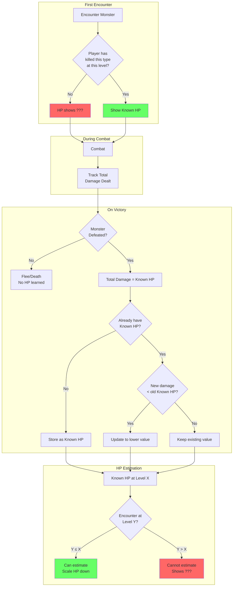
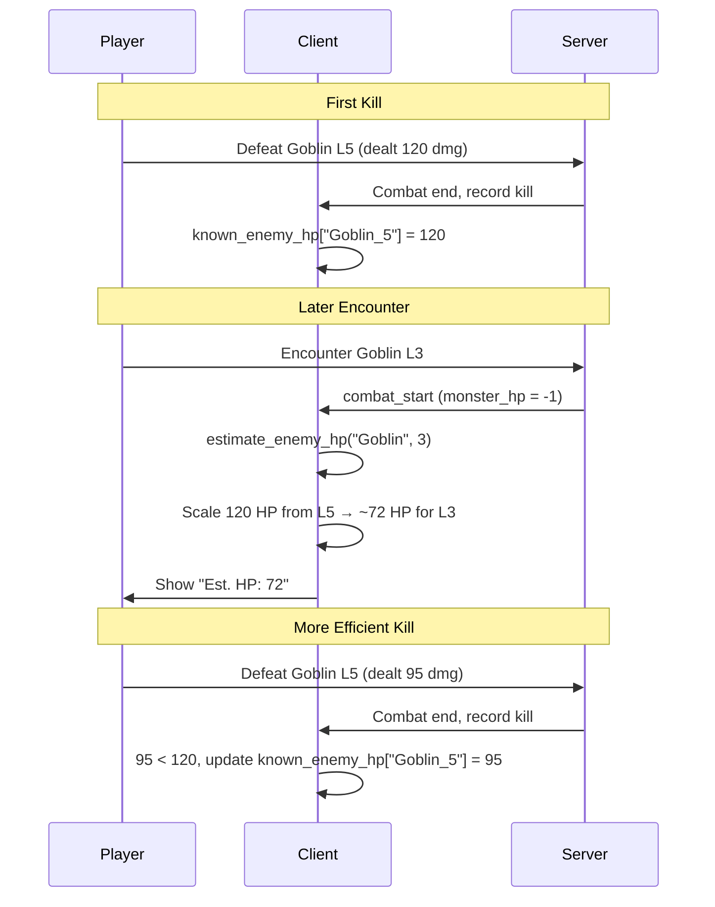

# Game Systems Reference

Detailed documentation for game features and mechanics.

## Monster HP Knowledge System

Players discover monster HP through combat experience, not by seeing actual values.

### Key Concepts

| Term | Description |
|------|-------------|
| **Known HP** | Total damage dealt when defeating a monster (may exceed actual HP due to overkill) |
| **Estimated HP** | Scaled from Known HP at higher levels |
| **Discovery** | Players gradually learn true HP by killing more efficiently |

### Data Flow

### Implementation Files

| File | Component |
|------|-----------|
| `shared/character.gd` | `knows_monster()` - Server-side kill tracking |
| `client/client.gd` | `known_enemy_hp` - Client damage tracking |
| `client/client.gd` | `estimate_enemy_hp()` - Level scaling |
| `shared/combat_manager.gd` | Sends `monster_hp = -1` for unknown |

---

## Gem Currency System

Gems are premium currency dropped by high-level monsters.

**Drop Conditions:**
- Monster level must exceed player level by 5+
- Drop chance scales with level difference (2% at 5+, up to 50% at 100+)
- Quantity: `max(1, lethality/1000 + level/100)`

**Drop Chance Table:**
| Level Diff | Chance |
|------------|--------|
| 5+ | 2% |
| 10+ | 5% |
| 20+ | 12% |
| 50+ | 25% |
| 100+ | 50% |

**Uses:**
- Sell to merchants (1000g each)
- Pay for equipment upgrades

---

## Class-Specific Gear

Special monsters drop class-path equipment with unique bonuses.

### Mage Gear (Arcane Hoarder monsters)
| Item | Stats | Class Bonus |
|------|-------|-------------|
| Arcane Ring | INT | Mana Regen/round |
| Mystic Amulet | Max Mana | Meditate bonus |

### Trickster Gear (Cunning Prey monsters)
| Item | Stats | Class Bonus |
|------|-------|-------------|
| Shadow Ring | WITS | Energy Regen/round |
| Evasion Amulet | Speed | Flee chance bonus |
| Swift Boots | Speed, WITS | Energy Regen/round |

### Warrior Gear (Warrior Hoarder monsters)
| Item | Stats | Class Bonus |
|------|-------|-------------|
| Warlord Blade | ATK, STR | Stamina Regen/round |
| Bulwark Shield | DEF, HP, CON | Stamina Regen/round |

**Drop Mechanics:**
- 35% chance from monsters with corresponding ability
- Items level-boosted +15% based on monster level

---

## Cloak System (Universal Ability)

Stealth ability unlocked at level 20 for all classes.

**Mechanics:**
- Costs 8% of max primary resource per movement
- Prevents monster encounters while moving
- Drops when resource runs out
- Hunting breaks cloak
- Merchants can still be encountered
- Toggle via action bar [4] in movement mode

**Display:** Purple `[Cloaked]` status indicator

---

## Ability Loadout System

Customize which abilities are equipped to 4 combat slots.

**Access:** Action bar [1] "Abilities" or `/abilities` command

**Features:**
- 4 slots for combat abilities (Q, W, E, R default)
- Custom keybinds per slot
- Shows unlocked abilities for class path
- Universal abilities available to all classes

**Backward Compatibility:** Empty loadout uses default class ability slots.

---

## Player Trading System

Trade items between players.

**Command:** `/trade <playername>`

**Requirements:**
- Same location
- Not in combat
- Not in existing trade

**Flow:**
1. Send trade request
2. Partner accepts/declines
3. Both add/remove items
4. Both mark "Ready"
5. Trade executes

**Cancellation Triggers:** Movement, combat, disconnect, explicit cancel

---

## Themed Equipment Display

Equipment names transform based on viewer's class.

**Example:** "Steel Weapon" appears as:
- Fighter: "Steel Sword"
- Barbarian: "Steel Axe"
- Wizard: "Steel Staff"
- Ranger: "Steel Bow"

See `Character.get_themed_item_name()` for full mappings.

---

## High-Tier Drop System (Tier 6+)

### Powerful Consumables
| Item | Effect |
|------|--------|
| Time Stop Scroll | Skip monster's next turn |
| Monster Bane Potions | +50% damage vs type (3 battles) |
| Resurrect Scroll | One-time death prevention |

### Mystery/Gambling Items
| Item | Effect |
|------|--------|
| Mysterious Box | Random item (same tier or +1) |
| Cursed Coin | 50% double gold, 50% lose half |

### Stat Tomes (Tier 6+)
Permanent +1 to a stat. One per stat type.
- Tome of Strength, Intelligence, Dexterity, etc.

### Skill Enhancers (Tier 7+)
Permanent ability upgrades:
- Reduced resource cost (-10%)
- Increased damage (+15%)

### Proc Equipment (Tier 6+)
Equipment with special effects:
| Proc | Effect |
|------|--------|
| Vampire | Lifesteal 10% |
| Thunder | 20% chain lightning |
| Reflection | Reflect 20% damage |
| Slayer | +25% vs type |

### Trophy Drops (Tier 8-9)
5% drop from specific bosses:
- Dragon Scale, Lich Phylactery, Titan Heart
- Entropy Shard (2% from Entropy)

### Soul Gems / Companions (Tier 7+)
Summon combat companions (one active at a time):
| Companion | Bonus |
|-----------|-------|
| Wolf Spirit | +10% attack |
| Phoenix Ember | 2% HP regen/round |
| Shadow Wisp | +15% flee chance |

---

## Quest Scaling System

Quests scale to player level with progressive difficulty.

**Mechanics:**
- Quest requirements scale to ~70-80% of player level
- Difficulty increases with quests completed at same post (+5% per quest, max +50%)
- Eventually pushes players toward next trading post

**Progression Quests:**
- Auto-generated exploration quests to next trading post
- Appear when player level >= recommended level for next post

---

## Shrieker Summoning

The Shrieker summons random high-tier monsters instead of copies.

| Tier | Chance | Examples |
|------|--------|----------|
| 4 | 40% | Giant, Dragon Wyrmling, Demon |
| 5 | 25% | Ancient Dragon, Demon Lord, Lich |
| 6 | 15% | Elemental, Iron Golem, Sphinx |
| 7 | 10% | Void Walker, World Serpent |
| 8 | 7% | Cosmic Horror, Time Weaver |
| 9 | 3% | Avatar of Chaos, Entropy |
