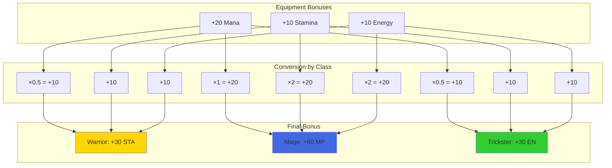
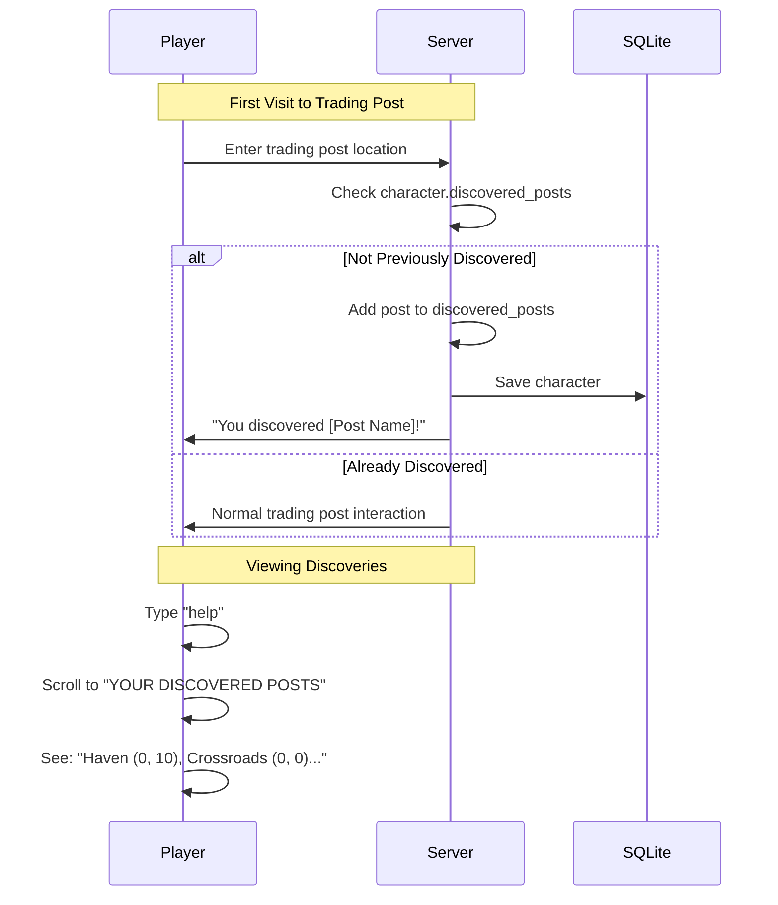
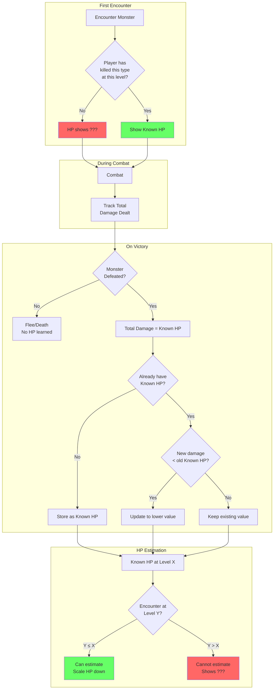
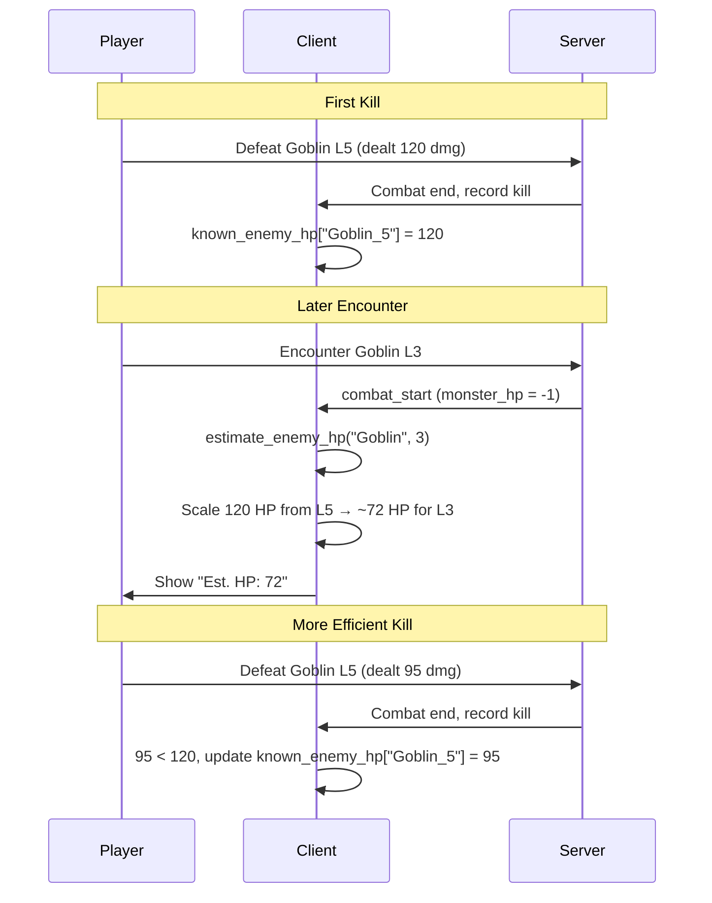
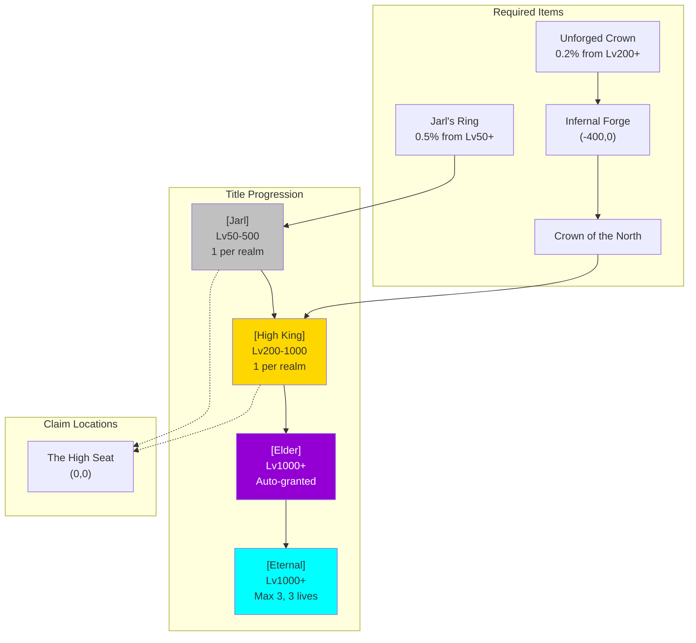
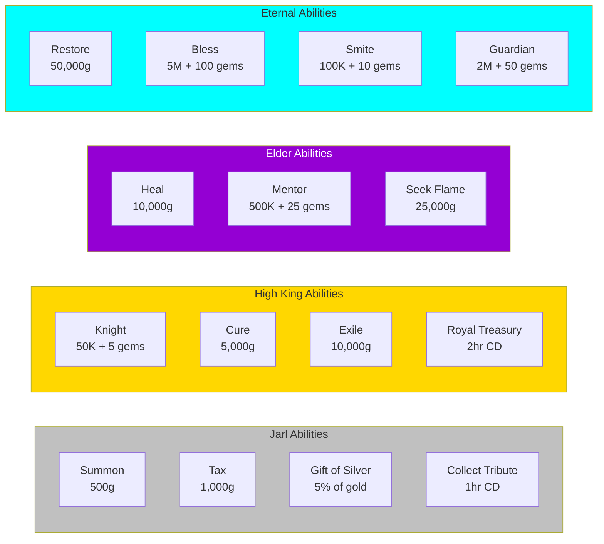
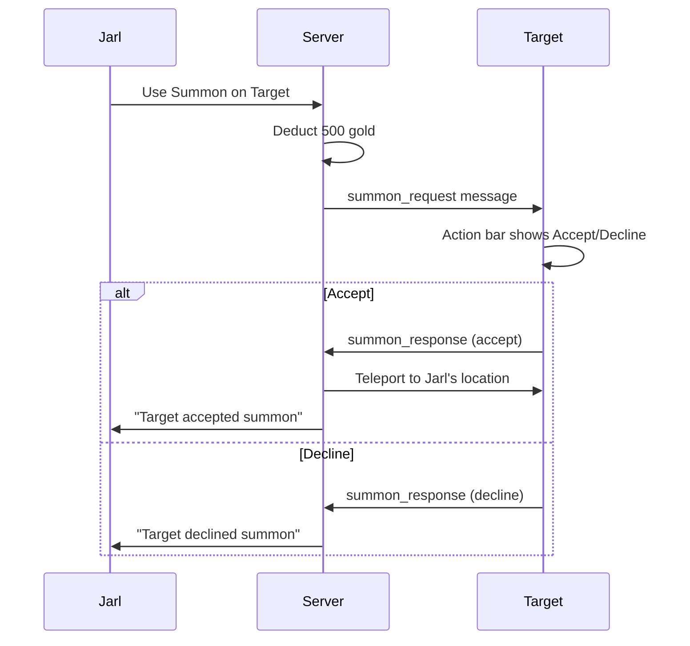
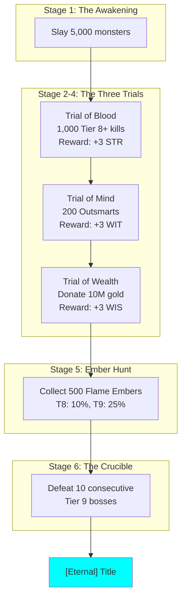

# Game Systems Reference

Detailed documentation for game features and mechanics.

## Account Limits

- **Max characters per account:** 6
- **Character deletion:** Permanent on death (permadeath)

---

## Universal Resource Bonuses

Equipment resource stats (mana, stamina, energy) convert to your class's primary resource.



### Conversion Rules

| Your Class Path | Primary Resource | Conversion |
|-----------------|------------------|------------|
| Warrior (Fighter, Barbarian, Paladin) | Stamina | Mana×0.5 + Stamina + Energy |
| Mage (Wizard, Sorcerer, Sage) | Mana | Mana + (Stamina+Energy)×2 |
| Trickster (Thief, Ranger, Ninja) | Energy | Mana×0.5 + Stamina + Energy |

### Why Scaling?

Mana affixes on equipment roll ~2× larger values than stamina/energy affixes. The scaling ensures balanced conversion:
- **Mana → Stamina/Energy:** 0.5× (halved because mana values are larger)
- **Stamina/Energy → Mana:** 2× (doubled to match mana's larger scale)

### Display

- Item tooltips show the converted value with your class's resource label (STA/EN/MP)
- Item comparison brackets show class-appropriate resource differences
- Equipment bonuses in stats screen show final converted values

### Implementation

See `shared/character.gd` `get_equipment_bonuses()` for conversion logic.

---

## Rare Monster Variants

Some monsters spawn as rare variants with enhanced stats.

### Variant Bonuses
- +50% HP
- +25% damage
- +50% XP reward
- +50% gold reward
- Better loot quality

### Visual Indicator

Rare variants display a **★** symbol before their name in the combat HP bar:
```
★ Goblin Warrior (Lvl 12): [████████░░] 85/170
```

### Flock Encounters

Rare variants can appear in flock encounters (multi-monster battles). Each monster in a flock has an independent chance to be a rare variant.

---

## Trading Post Discovery

Players can track which trading posts they've visited.



### How It Works

1. When you enter a trading post for the first time, it's recorded to your character
2. Discovered posts appear in your Help page under "YOUR DISCOVERED POSTS"
3. Shows post name and coordinates for easy navigation

### Persistence

Discovered posts are saved with your character data and persist across sessions.

### Viewing Discoveries

Type `help` and search for "discovered" or scroll to the Trading Posts section.

---

## Monster HP Knowledge System

Players discover monster HP through combat experience, not by seeing actual values.



### Key Concepts

| Term | Description |
|------|-------------|
| **Known HP** | Total damage dealt when defeating a monster (may exceed actual HP due to overkill) |
| **Estimated HP** | Scaled from Known HP at higher levels |
| **Discovery** | Players gradually learn true HP by killing more efficiently |

### Data Flow



### Implementation Files

| File | Component |
|------|-----------|
| `shared/character.gd` | `knows_monster()` - Server-side kill tracking |
| `client/client.gd` | `known_enemy_hp` - Client damage tracking |
| `client/client.gd` | `estimate_enemy_hp()` - Level scaling |
| `shared/combat_manager.gd` | Sends `monster_hp = -1` for unknown |

---

## Gem Currency System

Gems are premium currency dropped by high-level monsters.

**Drop Conditions:**
- Monster level must exceed player level by 5+
- Drop chance scales with level difference (2% at 5+, up to 50% at 100+)
- Quantity: `max(1, lethality/1000 + level/100)`

**Drop Chance Table:**
| Level Diff | Chance |
|------------|--------|
| 5+ | 2% |
| 10+ | 5% |
| 20+ | 12% |
| 50+ | 25% |
| 100+ | 50% |

**Uses:**
- Sell to merchants (1000g each)
- Pay for equipment upgrades

---

## Class-Specific Gear

Special monsters drop class-path equipment with unique bonuses.

### Mage Gear (Arcane Hoarder monsters)
| Item | Stats | Class Bonus |
|------|-------|-------------|
| Arcane Ring | INT | Mana Regen/round |
| Mystic Amulet | Max Mana | Meditate bonus |

### Trickster Gear (Cunning Prey monsters)
| Item | Stats | Class Bonus |
|------|-------|-------------|
| Shadow Ring | WITS | Energy Regen/round |
| Evasion Amulet | Speed | Flee chance bonus |
| Swift Boots | Speed, WITS | Energy Regen/round |

### Warrior Gear (Warrior Hoarder monsters)
| Item | Stats | Class Bonus |
|------|-------|-------------|
| Warlord Blade | ATK, STR | Stamina Regen/round |
| Bulwark Shield | DEF, HP, CON | Stamina Regen/round |

**Drop Mechanics:**
- 35% chance from monsters with corresponding ability
- Items level-boosted +15% based on monster level

---

## Cloak System (Universal Ability)

Stealth ability unlocked at level 20 for all classes.

**Mechanics:**
- Costs 8% of max primary resource per movement
- Prevents monster encounters while moving
- Drops when resource runs out
- Hunting breaks cloak
- Merchants can still be encountered
- Toggle via action bar [4] in movement mode

**Display:** Purple `[Cloaked]` status indicator

---

## Ability Loadout System

Customize which abilities are equipped to 4 combat slots.

**Access:** Settings menu [7] "Manage Abilities" or `/abilities` command

**Features:**
- 4 slots for combat abilities (Q, W, E, R default)
- Custom keybinds per slot
- Shows unlocked abilities for class path
- Universal abilities available to all classes

**Backward Compatibility:** Empty loadout uses default class ability slots.

---

## Player Trading System

Trade items between players.

**Command:** `/trade <playername>`

**Requirements:**
- Same location
- Not in combat
- Not in existing trade

**Flow:**
1. Send trade request
2. Partner accepts/declines
3. Both add/remove items
4. Both mark "Ready"
5. Trade executes

**Cancellation Triggers:** Movement, combat, disconnect, explicit cancel

---

## Themed Equipment Display

Equipment names transform based on viewer's class.

**Example:** "Steel Weapon" appears as:
- Fighter: "Steel Sword"
- Barbarian: "Steel Axe"
- Wizard: "Steel Staff"
- Ranger: "Steel Bow"

See `Character.get_themed_item_name()` for full mappings.

---

## High-Tier Drop System (Tier 6+)

### Powerful Consumables
| Item | Effect |
|------|--------|
| Time Stop Scroll | Skip monster's next turn |
| Monster Bane Potions | +50% damage vs type (3 battles) |
| Resurrect Scroll | One-time death prevention |

### Mystery/Gambling Items
| Item | Effect |
|------|--------|
| Mysterious Box | Random item (same tier or +1) |
| Cursed Coin | 50% double gold, 50% lose half |

### Stat Tomes (Tier 6+)
Permanent +1 to a stat. One per stat type.
- Tome of Strength, Intelligence, Dexterity, etc.

### Skill Enhancers (Tier 7+)
Permanent ability upgrades:
- Reduced resource cost (-10%)
- Increased damage (+15%)

### Proc Equipment (Tier 6+)
Equipment with special effects:
| Proc | Effect |
|------|--------|
| Vampire | Lifesteal 10% |
| Thunder | 20% chain lightning |
| Reflection | Reflect 20% damage |
| Slayer | +25% vs type |

### Trophy Drops (Tier 8-9)
5% drop from specific bosses:
- Dragon Scale, Lich Phylactery, Titan Heart
- Entropy Shard (2% from Entropy)

### Soul Gems / Companions (Tier 7+)
Summon combat companions (one active at a time):
| Companion | Bonus |
|-----------|-------|
| Wolf Spirit | +10% attack |
| Phoenix Ember | 2% HP regen/round |
| Shadow Wisp | +15% flee chance |

---

## Quest Scaling System

Quests scale to player level with progressive difficulty.

**Mechanics:**
- Quest requirements scale to ~70-80% of player level
- Difficulty increases with quests completed at same post (+5% per quest, max +50%)
- Eventually pushes players toward next trading post

**Progression Quests:**
- Auto-generated exploration quests to next trading post
- Appear when player level >= recommended level for next post

---

## Shrieker Summoning

The Shrieker summons random high-tier monsters instead of copies.

| Tier | Chance | Examples |
|------|--------|----------|
| 4 | 40% | Giant, Dragon Wyrmling, Demon |
| 5 | 25% | Ancient Dragon, Demon Lord, Lich |
| 6 | 15% | Elemental, Iron Golem, Sphinx |
| 7 | 10% | Void Walker, World Serpent |
| 8 | 7% | Cosmic Horror, Time Weaver |
| 9 | 3% | Avatar of Chaos, Entropy |

---

## Leaderboards

Two leaderboard views accessible via the "Leaders" button on the action bar or `/leaders` command.

### Hall of Fallen Heroes
Ranks deceased characters by experience gained before death.

**Display:** Character name, level, class, XP, cause of death
**Ranking:** Top 100 by experience (descending)

### Deadliest Monsters
Tracks which monsters have killed the most players (permadeath only).

**Display:** Monster name, total player kills
**Grouping:** All monster levels combined (e.g., all Ogres count together)
**Ranking:** Top 20 by kill count (descending)

**Toggle:** Use the "Show Deadliest Monsters" / "Show Fallen Heroes" button to switch views.

---

## Title System

Endgame progression through unique titles with powerful abilities.

### Title Hierarchy



### Title Requirements

| Title | Level | Item | Location | Unique |
|-------|-------|------|----------|--------|
| Jarl | 50-500 | Jarl's Ring | (0,0) | 1 per realm |
| High King | 200-1000 | Crown of the North | (0,0) | 1 per realm |
| Elder | 1000+ | None (auto) | N/A | Unlimited |
| Eternal | 1000+ | Pilgrimage | N/A | Max 3 |

### Title Abilities & Costs



### Special Statuses

| Status | Granted By | Bonuses | Duration |
|--------|------------|---------|----------|
| Knight | High King | +15% dmg, +10% gold | Until replaced |
| Mentee | Elder | +30% XP, +20% gold | Until replaced |
| Guardian Save | Eternal | One death prevented | Until used |

### Summon Consent System



---

## Eternal Pilgrimage

The path to becoming Eternal requires completing 6 stages.

### Pilgrimage Flow



### Pilgrimage Commands

| Command | Description |
|---------|-------------|
| Seek Flame | Check pilgrimage progress (Elder ability, 25K gold) |
| `/donate <amount>` | Donate gold at Shrine of Wealth (Trial of Wealth) |
| `/crucible` | Start the Crucible gauntlet (final stage) |

### Ember Drop Rates

| Source | Chance | Amount |
|--------|--------|--------|
| Tier 8 monster | 10% | 1 |
| Tier 9 monster | 25% | 1-3 |
| Rare variant | 100% | 2 |
| Boss monster | 100% | 5 |

### The Crucible

The final pilgrimage stage is a gauntlet of 10 consecutive Tier 9 boss fights.

**Rules:**
- Bosses are spawned one at a time
- Victory spawns the next boss immediately
- Death resets Crucible progress (but keeps previous trial completions)
- Cannot flee during Crucible
- Victory completes the pilgrimage and grants Eternal title

---

## Tax Collector System

Roaming tax collectors take gold from players.

**Trigger:** 5% chance per movement when carrying 100+ gold

**Tax Rate:** 8% of current gold (minimum 10g)

**Immunity:** Jarls and High Kings are immune to tax collection

**Variants:**
| Type | Effect |
|------|--------|
| Quick | Standard 8% tax |
| Bumbling | Only 5% tax |
| Veteran | 10% tax |
| Negotiator | Standard tax + 5% gold find for 3 battles |

---

## Abuse Prevention

Title holders can lose their title through abuse of power.

### Abuse Points

| Action | Points |
|--------|--------|
| Same target within 30 min | +3 |
| Targeting 20+ levels lower | +2 |
| Targeting player in combat | +3 |
| Spam (3+ abilities in 10 min) | +2 |

### Thresholds

| Title | Threshold |
|-------|-----------|
| Jarl | 8 points |
| High King | 15 points |

**Decay:** 1 point per hour

**Consequence:** Losing title removes all abilities and the title prefix
