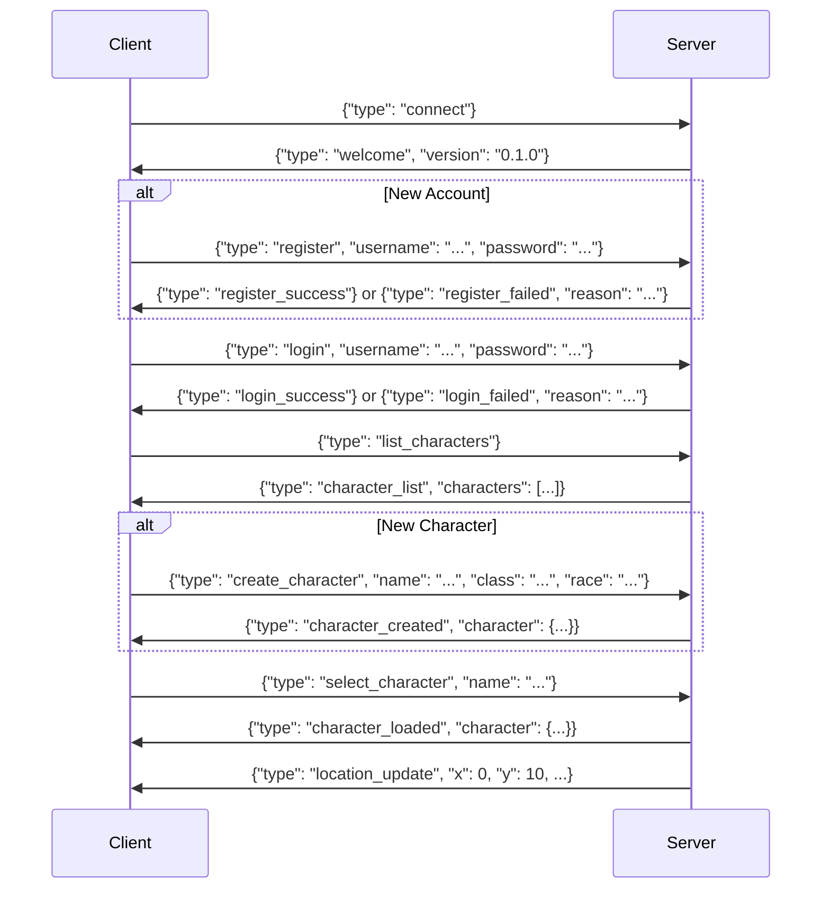
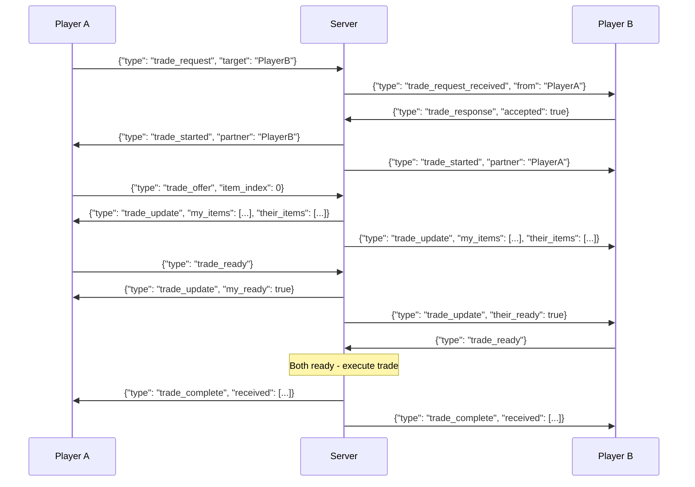
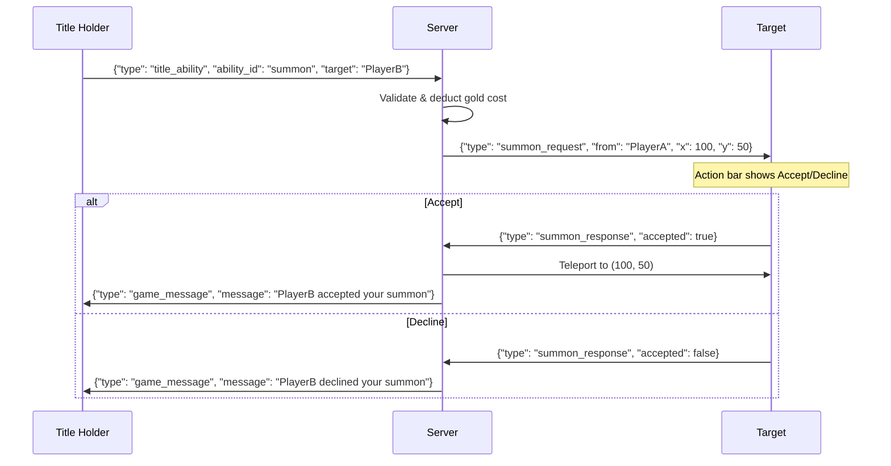
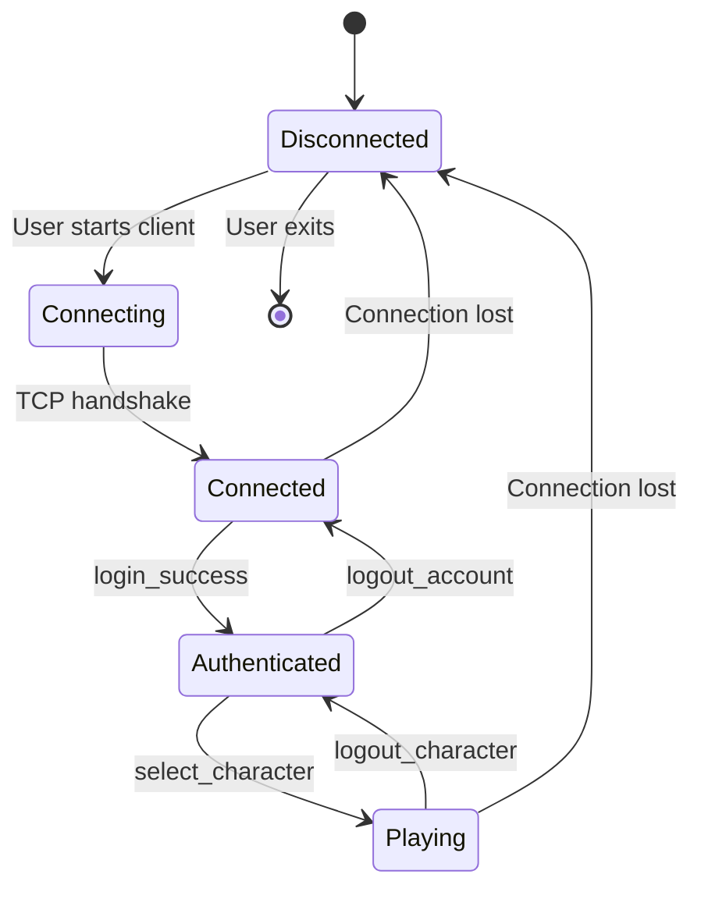

# Networking Protocol

## Transport Layer

- **Protocol:** TCP
- **Port:** 9080
- **Format:** Newline-delimited JSON (`\n` separator)
- **Connection:** Persistent (reconnect on disconnect)

## Message Format

```json
{
  "type": "message_type",
  "field1": "value1",
  "field2": "value2"
}
```

## Client → Server Messages

### Authentication Flow



### Movement & Exploration

| Message | Fields | Description |
|---------|--------|-------------|
| `move` | `direction` (n/s/e/w) | Move one tile |
| `hunt` | - | Actively seek combat |
| `rest` | - | Restore resources |
| `toggle_cloak` | - | Toggle stealth mode |

### Combat

| Message | Fields | Description |
|---------|--------|-------------|
| `combat_action` | `action`, `arg` | Combat command |

**Actions:** `attack`, `flee`, `outsmart`, ability names

### Inventory & Equipment

| Message | Fields | Description |
|---------|--------|-------------|
| `use_item` | `item_index` | Use consumable |
| `equip_item` | `item_index` | Equip to slot |
| `unequip_item` | `slot` | Remove from slot |
| `discard_item` | `item_index` | Delete item |
| `salvage` | `type`, `threshold` | Mass salvage |
| `sort_inventory` | `sort_by` | Reorder items |

### Merchant

| Message | Fields | Description |
|---------|--------|-------------|
| `merchant_sell` | `item_index` | Sell item |
| `merchant_buy` | `item_index` | Buy from shop |
| `merchant_upgrade` | `slot`, `count` | Upgrade equipment |
| `merchant_gamble` | `bet` | Dice game |
| `merchant_sell_gems` | `amount` | Convert gems to gold |

### Trading Post & Quests

| Message | Fields | Description |
|---------|--------|-------------|
| `accept_quest` | `quest_id` | Start quest |
| `turn_in_quest` | `quest_id` | Complete quest |
| `recharge` | - | Heal at trading post |

### Player Trading



### Abilities

| Message | Fields | Description |
|---------|--------|-------------|
| `get_abilities` | - | Request ability data |
| `equip_ability` | `slot`, `ability_id` | Set ability to slot |
| `unequip_ability` | `slot` | Clear ability slot |
| `set_ability_keybind` | `slot`, `key` | Change keybind |

### Title System

| Message | Fields | Description |
|---------|--------|-------------|
| `title_menu` | - | Open title menu |
| `claim_title` | `title_id` | Claim Jarl/High King title |
| `title_ability` | `ability_id`, `target` | Use title ability |
| `title_ability` | `ability_id`, `target`, `stat` | Bless with stat choice |
| `pilgrimage_donate` | `amount` | Donate gold to Shrine of Wealth |
| `start_crucible` | - | Start the Crucible gauntlet |
| `summon_response` | `accepted` | Accept/decline summon request |
| `forge_crown` | - | Forge crown at Fire Mountain |

### Title Ability Flow (Summon with Consent)



## Server → Client Messages

### Game State Updates

| Message | Key Fields | Description |
|---------|------------|-------------|
| `location_update` | `x`, `y`, `terrain`, `description`, `map` | Position update |
| `character_update` | `character` (full object) | Stats changed |
| `combat_start` | `monster`, `combat_state`, `use_client_art` | Battle begins |
| `combat_update` | `message`, `combat_state` | Round result |
| `combat_end` | `victory`, `rewards`, `message` | Battle ends |
| `chat_message` | `sender`, `message`, `channel` | Chat received |
| `quest_progress` | `quest_id`, `progress`, `completed` | Quest update |
| `title_menu_data` | `titles`, `current_title`, `abilities`, `hints` | Title menu content |
| `summon_request` | `from`, `x`, `y` | Incoming summon request |
| `crucible_start` | `boss_number`, `monster` | Crucible boss spawned |
| `crucible_complete` | - | Pilgrimage complete, Eternal granted |

### Combat State Object

```json
{
  "monster_name": "Goblin",
  "monster_hp": 45,
  "monster_max_hp": 50,
  "monster_level": 5,
  "monster_abilities": ["poison", "ambusher"],
  "player_hp": 100,
  "player_max_hp": 120,
  "player_mana": 50,
  "player_stamina": 30,
  "player_energy": 40,
  "round": 2,
  "active_buffs": ["war_cry"],
  "forcefield_shield": 0,
  "use_client_art": true
}
```

### Error Handling

```json
{
  "type": "error",
  "message": "Description of what went wrong"
}
```

## Message Type Constants

From `shared/constants.gd`:

```gdscript
# Client → Server
MSG_CONNECT = "connect"
MSG_REGISTER = "register"
MSG_LOGIN = "login"
MSG_LIST_CHARACTERS = "list_characters"
MSG_SELECT_CHARACTER = "select_character"
MSG_CREATE_CHARACTER = "create_character"
MSG_DELETE_CHARACTER = "delete_character"
MSG_MOVE = "move"
MSG_ACTION = "action"
MSG_COMBAT_ACTION = "combat_action"
MSG_CHAT = "chat"
MSG_HEARTBEAT = "heartbeat"
MSG_GET_LEADERBOARD = "get_leaderboard"
MSG_LOGOUT_CHARACTER = "logout_character"
MSG_LOGOUT_ACCOUNT = "logout_account"

# Server → Client
MSG_WELCOME = "welcome"
MSG_REGISTER_SUCCESS = "register_success"
MSG_REGISTER_FAILED = "register_failed"
MSG_LOGIN_SUCCESS = "login_success"
MSG_LOGIN_FAILED = "login_failed"
MSG_CHARACTER_LIST = "character_list"
MSG_CHARACTER_LOADED = "character_loaded"
MSG_CHAR_CREATED = "character_created"
MSG_CHAR_DELETED = "character_deleted"
MSG_LOCATION_UPDATE = "location_update"
MSG_COMBAT_START = "combat_start"
MSG_COMBAT_UPDATE = "combat_update"
MSG_COMBAT_END = "combat_end"
MSG_CHAT_MESSAGE = "chat_message"
MSG_PERMADEATH = "permadeath"
MSG_LEADERBOARD = "leaderboard"
MSG_ERROR = "error"
```

## Connection Lifecycle


