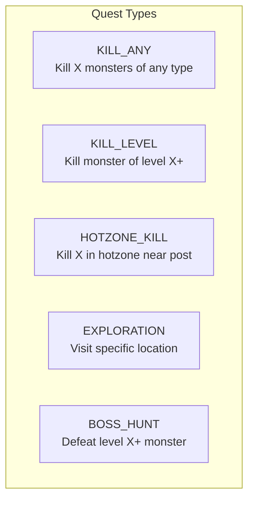
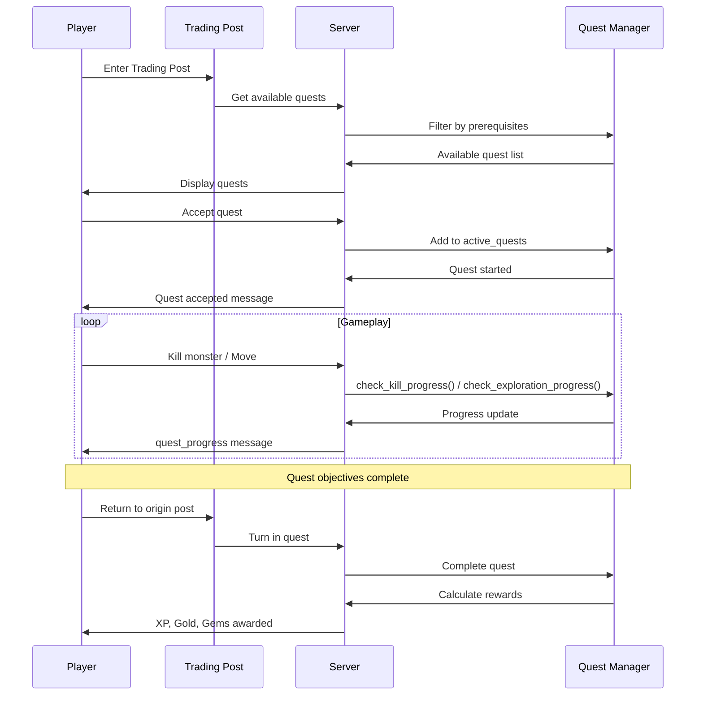
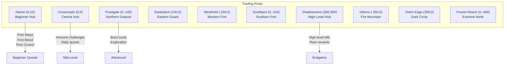
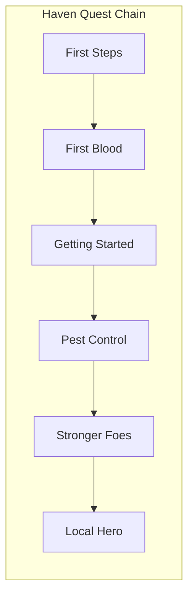

# Quest System

## Quest Types



| Type | Target Field | Description |
|------|--------------|-------------|
| `KILL_ANY` | `target` = count | Kill any monsters |
| `KILL_LEVEL` | `target` = min level, `kill_count` = count | Kill monsters above level |
| `HOTZONE_KILL` | `target` = count, `max_distance` = range | Kill in nearby hotzones |
| `EXPLORATION` | `destination_post` = trading post ID | Visit a location |
| `BOSS_HUNT` | `target` = min level | Single powerful kill |

## Quest Flow



## Quest Data Structure

```json
{
  "id": "haven_first_steps",
  "name": "First Steps",
  "description": "Defeat your first monster.",
  "type": 0,
  "trading_post": "haven",
  "target": 1,
  "rewards": {
    "xp": 25,
    "gold": 15,
    "gems": 0
  },
  "is_daily": false,
  "prerequisite": ""
}
```

## Active Quest Tracking

```json
{
  "quest_id": "haven_first_steps",
  "progress": 0,
  "target": 1,
  "started_at": 1706000000
}
```

## Trading Posts & Their Quests



## Quest Prerequisites



## Reward Multipliers

| Condition | Multiplier |
|-----------|------------|
| Base | 1.0x |
| Hotzone Quest | 1.5x - 2.5x |
| Daily Quest | 1.2x |
| High-level target | Scales with level |

## Character Quest Limits

```gdscript
const MAX_ACTIVE_QUESTS = 5

# Character fields
active_quests: Array        # Currently tracking
completed_quests: Array     # Permanently done (one-time)
daily_quest_cooldowns: Dict # Timestamps for daily reset
```

## Quest Progress Checking

### Kill Progress
```gdscript
func check_kill_progress(character, monster_level, location):
    for quest in character.active_quests:
        match quest.type:
            KILL_ANY:
                quest.progress += 1
            KILL_LEVEL:
                if monster_level >= quest.target:
                    quest.progress += 1
            HOTZONE_KILL:
                if is_in_hotzone(location) and within_distance(quest):
                    quest.progress += 1
```

### Exploration Progress
```gdscript
func check_exploration_progress(character, current_location, trading_post_id):
    for quest in character.active_quests:
        if quest.type == EXPLORATION:
            if quest.destination_post == trading_post_id:
                quest.progress = quest.target  # Complete
```

## UI Integration

### Quest Display Colors
- **Available:** Green `#00FF00`
- **In Progress:** Yellow `#FFFF00`
- **Complete (turn in):** Cyan `#00FFFF`
- **Daily (on cooldown):** Gray `#808080`

### Sound Effects
- Quest accepted: None (silent)
- Quest progress: None (silent)
- Quest complete: `quest_complete_player` sound (G5 → C6 chime)
- Quest turned in: Gold sound + completion message

### Action Bar at Trading Post
```
[Status] [Shop] [Quests] [Heal(Ng)] [---] [---] [---] [---] [---] [---]
```

When in quest view:
```
[Back] [---] [---] [---] [---] [---] [---] [---] [---] [---]
(Number keys 1-9 to select quests)
```
